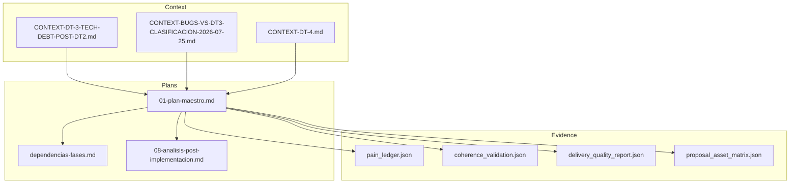
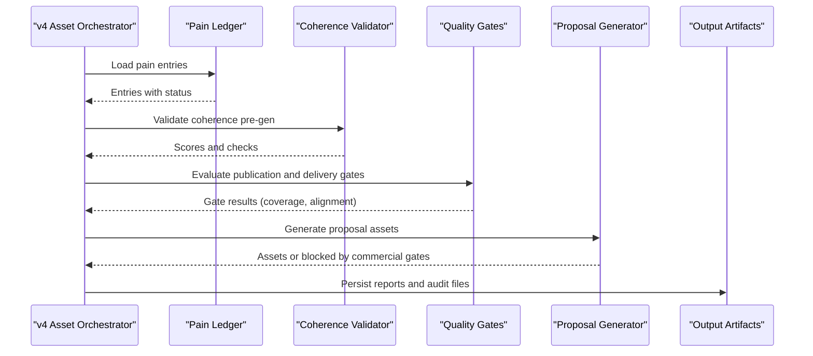
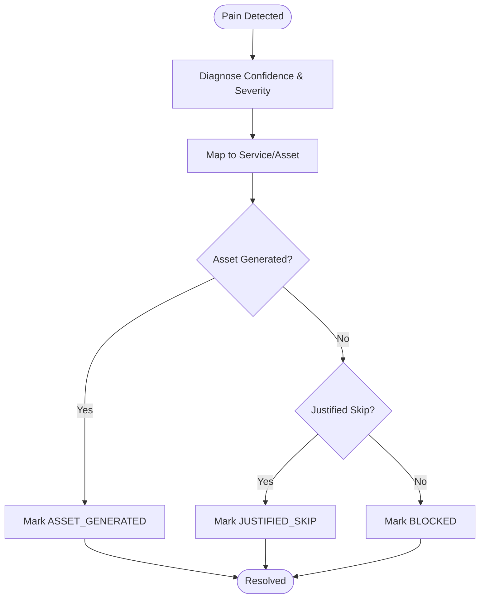
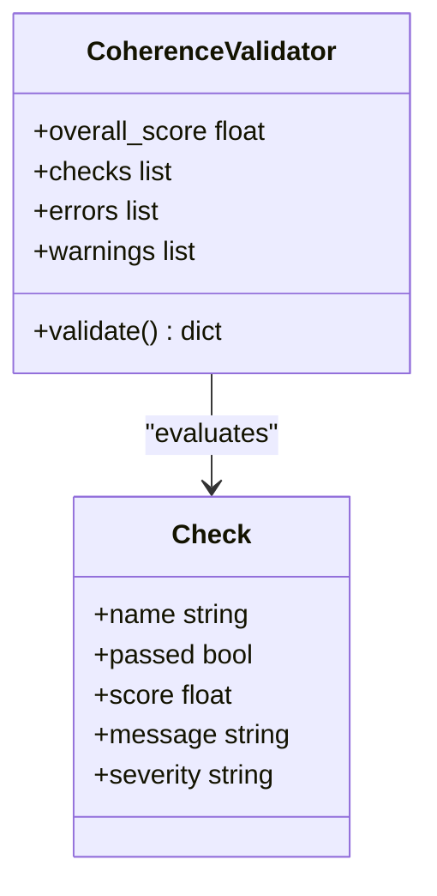
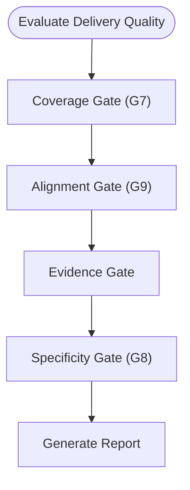
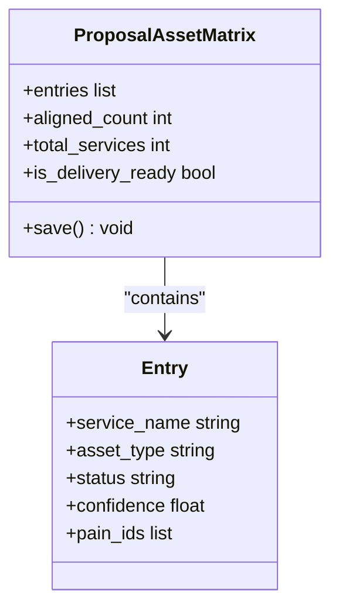
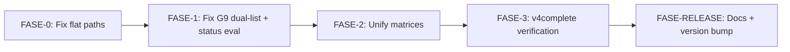

# DT-3 Technical Debt Methodology

<cite>
**Referenced Files in This Document**
- [CONTEXT-DT-3-TECH-DEBT-POST-DT2.md](file://context/Historico/CONTEXT-DT-3-TECH-DEBT-POST-DT2.md)
- [01-plan-maestro.md](file://plans/Archives/DT-3-TECH-DEBT-2026-07-25/01-plan-maestro.md)
- [dependencias-fases.md](file://plans/Archives/DT-3-TECH-DEBT-2026-07-25/dependencias-fases.md)
- [pain_ledger.json](file://plans/Archives/DT-3-TECH-DEBT-2026-07-25/evidence/pain_ledger.json)
- [coherence_validation.json](file://plans/Archives/DT-3-TECH-DEBT-2026-07-25/evidence/coherence_validation.json)
- [delivery_quality_report.json](file://plans/Archives/DT-3-TECH-DEBT-2026-07-25/evidence/delivery_quality_report.json)
- [proposal_asset_matrix.json](file://plans/Archives/DT-3-TECH-DEBT-2026-07-25/evidence/proposal_asset_matrix.json)
- [CONTEXT-BUGS-VS-DT3-CLASIFICACION-2026-07-25.md](file://context/Historico/CONTEXT-BUGS-VS-DT3-CLASIFICACION-2026-07-25.md)
- [CONTEXT-DT-4.md](file://context/Historico/CONTEXT-DT-4.md)
- [08-analisis-post-implementacion.md](file://plans/Archives/DT-3-TECH-DEBT-2026-07-25/08-analisis-post-implementacion.md)
</cite>

## Table of Contents
1. Introduction
2. Project Structure
3. Core Components
4. Architecture Overview
5. Detailed Component Analysis
6. Dependency Analysis
7. Performance Considerations
8. Troubleshooting Guide
9. Conclusion
10. Appendices

## Introduction
This document explains the DT-3 Technical Debt methodology for systematic technical debt identification, categorization, and resolution. It focuses on the post-DT-2 approach that addresses critical bugs (BUG-1 through BUG-4) blocking delivery pipelines. The methodology emphasizes evidence-based debugging using a pain ledger, coherence validation, and commercial gate reporting. It details a multi-phase implementation strategy from FASE-0 through FASE-RELEASE, prioritizing root cause fixes before unifying technical debt artifacts. It also includes examples of bug classification (CRITICAL vs MEDIUM severity), delegate_task viability assessment, safety guard mechanisms, and how technical debt is tracked via structured plans with clear success criteria (DoD S-1 to S-14) and dependency management between phases.

## Project Structure
The DT-3 methodology is documented and executed within a structured repository layout:
- Context documents describe the problem space, audits, and classifications.
- Plans define phased execution, dependencies, and checklists.
- Evidence files capture runtime outputs used for validation and debugging.

**Diagram sources**
- [CONTEXT-DT-3-TECH-DEBT-POST-DT2.md](file://context/Historico/CONTEXT-DT-3-TECH-DEBT-POST-DT2.md)
- [01-plan-maestro.md](file://plans/Archives/DT-3-TECH-DEBT-2026-07-25/01-plan-maestro.md)
- [dependencias-fases.md](file://plans/Archives/DT-3-TECH-DEBT-2026-07-25/dependencias-fases.md)
- [pain_ledger.json](file://plans/Archives/DT-3-TECH-DEBT-2026-07-25/evidence/pain_ledger.json)
- [coherence_validation.json](file://plans/Archives/DT-3-TECH-DEBT-2026-07-25/evidence/coherence_validation.json)
- [delivery_quality_report.json](file://plans/Archives/DT-3-TECH-DEBT-2026-07-25/evidence/delivery_quality_report.json)
- [proposal_asset_matrix.json](file://plans/Archives/DT-3-TECH-DEBT-2026-07-25/evidence/proposal_asset_matrix.json)

**Section sources**
- [CONTEXT-DT-3-TECH-DEBT-POST-DT2.md](file://context/Historico/CONTEXT-DT-3-TECH-DEBT-POST-DT2.md)
- [01-plan-maestro.md](file://plans/Archives/DT-3-TECH-DEBT-2026-07-25/01-plan-maestro.md)
- [dependencias-fases.md](file://plans/Archives/DT-3-TECH-DEBT-2026-07-25/dependencias-fases.md)

## Core Components
The DT-3 methodology centers around three pillars:
- Pain Ledger: A structured record of detected pains and their lifecycle status.
- Coherence Validation: A scoring system ensuring assets align with pains and financial data validity.
- Commercial Gate Reporting: Visibility into commercial gates that can block proposal generation.

Key components and their roles:
- Pain Ledger entries track confidence, severity, source module, and status transitions.
- Coherence checks validate asset justification, financial data, and specific signals like WhatsApp presence.
- Delivery quality gates evaluate coverage, alignment, and evidence readiness.

**Section sources**
- [pain_ledger.json](file://plans/Archives/DT-3-TECH-DEBT-2026-07-25/evidence/pain_ledger.json)
- [coherence_validation.json](file://plans/Archives/DT-3-TECH-DEBT-2026-07-25/evidence/coherence_validation.json)
- [delivery_quality_report.json](file://plans/Archives/DT-3-TECH-DEBT-2026-07-25/evidence/delivery_quality_report.json)

## Architecture Overview
The DT-3 pipeline integrates multiple modules to produce validated deliverables. The architecture ensures traceability from pain detection to asset generation and quality gating.

**Diagram sources**
- [CONTEXT-DT-4.md](file://context/Historico/CONTEXT-DT-4.md)
- [08-analisis-post-implementacion.md](file://plans/Archives/DT-3-TECH-DEBT-2026-07-25/08-analisis-post-implementacion.md)

## Detailed Component Analysis

### Pain Ledger Lifecycle
The pain ledger tracks each pain’s journey from detection to resolution. Statuses include DETECTED, DIAGNOSED, MAPPED_TO_SERVICE, ASSET_GENERATED, JUSTIFIED_SKIP, and BLOCKED. The ledger is consumed by coverage and alignment gates to determine if pains are addressed.

**Diagram sources**
- [pain_ledger.json](file://plans/Archives/DT-3-TECH-DEBT-2026-07-25/evidence/pain_ledger.json)

**Section sources**
- [pain_ledger.json](file://plans/Archives/DT-3-TECH-DEBT-2026-07-25/evidence/pain_ledger.json)

### Coherence Validation Checks
Coherence validation scores ensure alignment between problems and solutions. Key checks include asset justification, financial data validity, and specific signals like WhatsApp verification.

**Diagram sources**
- [coherence_validation.json](file://plans/Archives/DT-3-TECH-DEBT-2026-07-25/evidence/coherence_validation.json)

**Section sources**
- [coherence_validation.json](file://plans/Archives/DT-3-TECH-DEBT-2026-07-25/evidence/coherence_validation.json)

### Delivery Quality Gates
Delivery quality gates assess coverage, alignment, and evidence readiness. G9 specifically evaluates proposal asset alignment, which was a focal point of DT-3 fixes.

**Diagram sources**
- [delivery_quality_report.json](file://plans/Archives/DT-3-TECH-DEBT-2026-07-25/evidence/delivery_quality_report.json)

**Section sources**
- [delivery_quality_report.json](file://plans/Archives/DT-3-TECH-DEBT-2026-07-25/evidence/delivery_quality_report.json)

### Proposal Asset Matrix
The proposal asset matrix maps services to assets and tracks alignment status. It was unified in DT-3 to resolve semantic divergence between models.

**Diagram sources**
- [proposal_asset_matrix.json](file://plans/Archives/DT-3-TECH-DEBT-2026-07-25/evidence/proposal_asset_matrix.json)

**Section sources**
- [proposal_asset_matrix.json](file://plans/Archives/DT-3-TECH-DEBT-2026-07-25/evidence/proposal_asset_matrix.json)

## Dependency Analysis
The DT-3 plan defines strict phase dependencies to ensure root causes are fixed before addressing technical debt unification.

**Diagram sources**
- [dependencias-fases.md](file://plans/Archives/DT-3-TECH-DEBT-2026-07-25/dependencias-fases.md)

**Section sources**
- [dependencias-fases.md](file://plans/Archives/DT-3-TECH-DEBT-2026-07-25/dependencias-fases.md)

## Performance Considerations
- Phase isolation ensures focused testing and reduces regression risk.
- Evidence-based validation minimizes false positives in gate evaluations.
- Prioritizing root cause fixes prevents cascading issues during unification.

[No sources needed since this section provides general guidance]

## Troubleshooting Guide
Common issues and resolutions:
- Coverage gate false positives: Ensure skipped assets propagate pain IDs to the ledger.
- Commercial gates hidden: Persist commercial gate reports and update error messages.
- Optimistic scenario negative: Reinterpret semantically rather than clamping values.
- Divergent G9 systems: Unify consumers to use the same contract.

**Section sources**
- [CONTEXT-DT-4.md](file://context/Historico/CONTEXT-DT-4.md)
- [08-analisis-post-implementacion.md](file://plans/Archives/DT-3-TECH-DEBT-2026-07-25/08-analisis-post-implementacion.md)

## Conclusion
The DT-3 methodology provides a robust framework for managing technical debt through systematic identification, evidence-based debugging, and phased resolution. By prioritizing root cause fixes and maintaining clear success criteria, it ensures reliable delivery pipelines and scalable debt reduction.

[No sources needed since this section summarizes without analyzing specific files]

## Appendices

### Success Criteria (DoD S-1 to S-14)
- S-1 to S-14 define verifiable outcomes for each phase, including path corrections, gate behavior, unification, and release readiness.

**Section sources**
- [01-plan-maestro.md](file://plans/Archives/DT-3-TECH-DEBT-2026-07-25/01-plan-maestro.md)

### Bug Classification Examples
- CRITICAL: Bugs blocking delivery pipelines (e.g., BUG-1, BUG-6).
- MEDIUM: Issues affecting consistency or interpretation (e.g., BUG-8, BUG-9).

**Section sources**
- [CONTEXT-BUGS-VS-DT3-CLASIFICACION-2026-07-25.md](file://context/Historico/CONTEXT-BUGS-VS-DT3-CLASIFICACION-2026-07-25.md)

### Delegate Task Viability Assessment
- FASE-0 and FASE-1 are viable for delegation due to localized changes.
- FASE-2 requires direct agent involvement for architectural decisions.

**Section sources**
- [01-plan-maestro.md](file://plans/Archives/DT-3-TECH-DEBT-2026-07-25/01-plan-maestro.md)

### Safety Guard Mechanisms
- WSL safety guards prevent destructive commands.
- Pre-commit hooks enforce version consistency.

**Section sources**
- [CONTEXT-DT-3-TECH-DEBT-POST-DT2.md](file://context/Historico/CONTEXT-DT-3-TECH-DEBT-POST-DT2.md)