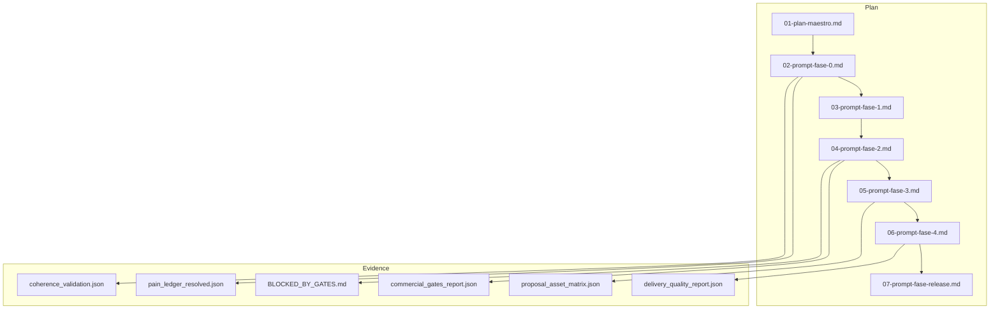
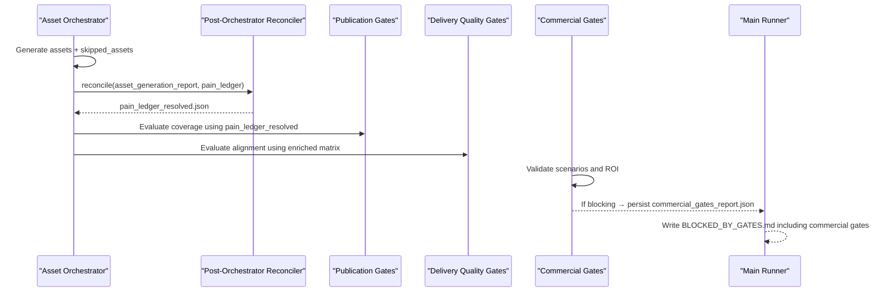
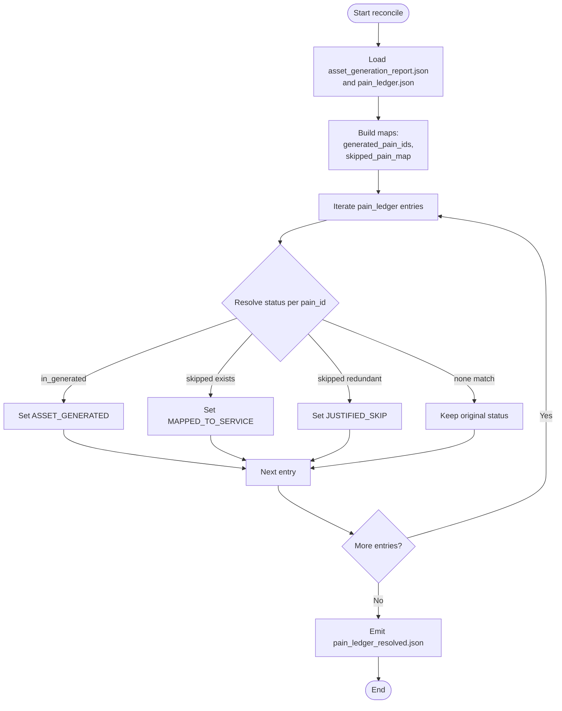
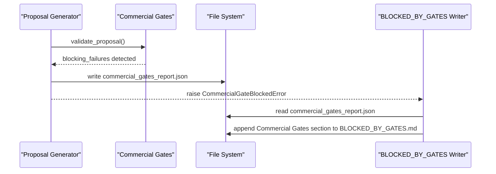
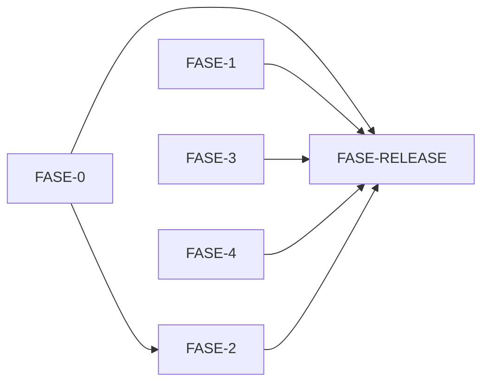

# DT-4 Root Cause Analysis Framework

<cite>
**Referenced Files in This Document**
- [CONTEXT-DT-4.md](file://context/Historico/CONTEXT-DT-4.md)
- [01-plan-maestro.md](file://plans/Archives/DT-4-ROOT-CAUSE-2026-07-25/01-plan-maestro.md)
- [02-prompt-fase-0.md](file://plans/Archives/DT-4-ROOT-CAUSE-2026-07-25/02-prompt-fase-0.md)
- [03-prompt-fase-1.md](file://plans/Archives/DT-4-ROOT-CAUSE-2026-07-25/03-prompt-fase-1.md)
- [04-prompt-fase-2.md](file://plans/Archives/DT-4-ROOT-CAUSE-2026-07-25/04-prompt-fase-2.md)
- [05-prompt-fase-3.md](file://plans/Archives/DT-4-ROOT-CAUSE-2026-07-25/05-prompt-fase-3.md)
- [06-prompt-fase-4.md](file://plans/Archives/DT-4-ROOT-CAUSE-2026-07-25/06-prompt-fase-4.md)
- [07-prompt-fase-release.md](file://plans/Archives/DT-4-ROOT-CAUSE-2026-07-25/07-prompt-fase-release.md)
- [commercial_gates_report.json](file://plans/Archives/DT-4-ROOT-CAUSE-2026-07-25/evidence/commercial_gates_report.json)
- [BLOCKED_BY_GATES.md](file://plans/Archives/DT-4-ROOT-CAUSE-2026-07-25/evidence/BLOCKED_BY_GATES.md)
- [coherence_validation.json](file://plans/Archives/DT-4-ROOT-CAUSE-2026-07-25/evidence/coherence_validation.json)
- [pain_ledger_resolved.json](file://plans/Archives/DT-4-ROOT-CAUSE-2026-07-25/evidence/pain_ledger_resolved.json)
- [delivery_quality_report.json](file://plans/Archives/DT-4-ROOT-CAUSE-2026-07-25/evidence/delivery_quality_report.json)
- [proposal_asset_matrix.json](file://plans/Archives/DT-4-ROOT-CAUSE-2026-07-25/evidence/proposal_asset_matrix.json)
</cite>

## Table of Contents
1. Introduction
2. Project Structure
3. Core Components
4. Architecture Overview
5. Detailed Component Analysis
6. Dependency Analysis
7. Performance Considerations
8. Troubleshooting Guide
9. Conclusion
10. Appendices

## Introduction
This document explains the DT-4 Root Cause Analysis framework for systematically identifying and resolving underlying system issues, with a focus on migration between flat and per-hotel routing patterns and the reconciliation of multiple sources of truth after asset orchestration. It details evidence collection techniques (commercial gates reporting, blocked-by-gates analysis, coherence validation), the multi-phase approach from initial diagnosis through release preparation, and how DT-4 complements DT-3 by providing deeper investigative capabilities for complex systemic issues.

## Project Structure
The DT-4 plan is organized into a master plan and phase-specific prompts, plus an evidence directory containing JSON artifacts and reports produced during v4complete runs. The structure supports a disciplined, phased execution model where each phase targets specific bugs or findings and produces verifiable outputs.

**Diagram sources**
- [01-plan-maestro.md](file://plans/Archives/DT-4-ROOT-CAUSE-2026-07-25/01-plan-maestro.md)
- [02-prompt-fase-0.md](file://plans/Archives/DT-4-ROOT-CAUSE-2026-07-25/02-prompt-fase-0.md)
- [03-prompt-fase-1.md](file://plans/Archives/DT-4-ROOT-CAUSE-2026-07-25/03-prompt-fase-1.md)
- [04-prompt-fase-2.md](file://plans/Archives/DT-4-ROOT-CAUSE-2026-07-25/04-prompt-fase-2.md)
- [05-prompt-fase-3.md](file://plans/Archives/DT-4-ROOT-CAUSE-2026-07-25/05-prompt-fase-3.md)
- [06-prompt-fase-4.md](file://plans/Archives/DT-4-ROOT-CAUSE-2026-07-25/06-prompt-fase-4.md)
- [07-prompt-fase-release.md](file://plans/Archives/DT-4-ROOT-CAUSE-2026-07-25/07-prompt-fase-release.md)
- [commercial_gates_report.json](file://plans/Archives/DT-4-ROOT-CAUSE-2026-07-25/evidence/commercial_gates_report.json)
- [BLOCKED_BY_GATES.md](file://plans/Archives/DT-4-ROOT-CAUSE-2026-07-25/evidence/BLOCKED_BY_GATES.md)
- [coherence_validation.json](file://plans/Archives/DT-4-ROOT-CAUSE-2026-07-25/evidence/coherence_validation.json)
- [pain_ledger_resolved.json](file://plans/Archives/DT-4-ROOT-CAUSE-2026-07-25/evidence/pain_ledger_resolved.json)
- [delivery_quality_report.json](file://plans/Archives/DT-4-ROOT-CAUSE-2026-07-25/evidence/delivery_quality_report.json)
- [proposal_asset_matrix.json](file://plans/Archives/DT-4-ROOT-CAUSE-2026-07-25/evidence/proposal_asset_matrix.json)

**Section sources**
- [01-plan-maestro.md](file://plans/Archives/DT-4-ROOT-CAUSE-2026-07-25/01-plan-maestro.md)

## Core Components
- Post-Orchestrator Reconciler: A new module that consolidates three disparate sources of truth about pain resolution into a single canonical state file.
- Commercial Gates Reporting: Persistence of commercial gate results before aborting proposal generation, enabling visibility and actionable guidance.
- Blocked-by-Gates Analysis: Enhanced BLOCKED_BY_GATES.md to include commercial gates when present and remove misleading re-run instructions.
- Coherence Validation: Improved checks that leverage site presence data to boost confidence for WhatsApp verification.
- Delivery Quality and Proposal Alignment: Resolution of divergence between publication and delivery quality assessments via unified alignment and enriched status propagation.

Key outcomes:
- A reconciled pain ledger that eliminates false positives in coverage and aligns publication vs delivery quality metrics.
- Transparent commercial gate failures with clear next steps.
- Consistent coherence scoring informed by site presence signals.

**Section sources**
- [02-prompt-fase-0.md](file://plans/Archives/DT-4-ROOT-CAUSE-2026-07-25/02-prompt-fase-0.md)
- [04-prompt-fase-2.md](file://plans/Archives/DT-4-ROOT-CAUSE-2026-07-25/04-prompt-fase-2.md)
- [coherence_validation.json](file://plans/Archives/DT-4-ROOT-CAUSE-2026-07-25/evidence/coherence_validation.json)
- [delivery_quality_report.json](file://plans/Archives/DT-4-ROOT-CAUSE-2026-07-25/evidence/delivery_quality_report.json)
- [proposal_asset_matrix.json](file://plans/Archives/DT-4-ROOT-CAUSE-2026-07-25/evidence/proposal_asset_matrix.json)

## Architecture Overview
The DT-4 architecture introduces a post-orchestrator reconciler that sits between asset generation and downstream gate evaluations. It reads asset generation reports and the original pain ledger to produce a resolved ledger used by publication and delivery quality gates. Commercial gates are persisted prior to raising blocking errors, and BLOCKED_BY_GATES.md is enhanced to reflect both publication and commercial gate states.

**Diagram sources**
- [02-prompt-fase-0.md](file://plans/Archives/DT-4-ROOT-CAUSE-2026-07-25/02-prompt-fase-0.md)
- [04-prompt-fase-2.md](file://plans/Archives/DT-4-ROOT-CAUSE-2026-07-25/04-prompt-fase-2.md)
- [commercial_gates_report.json](file://plans/Archives/DT-4-ROOT-CAUSE-2026-07-25/evidence/commercial_gates_report.json)
- [BLOCKED_BY_GATES.md](file://plans/Archives/DT-4-ROOT-CAUSE-2026-07-25/evidence/BLOCKED_BY_GATES.md)

## Detailed Component Analysis

### Post-Orchestrator Reconciler (FASE-0)
Purpose:
- Consolidate three sources of truth: pain_ledger entries, generated assets’ resolved pains, and skipped assets’ affected pains.
- Emit a canonical pain_ledger_resolved.json with final statuses per pain_id.

Behavior:
- Mark ASSET_GENERATED when a generated asset resolves a pain.
- Mark MAPPED_TO_SERVICE when a skipped asset indicates presence=exists.
- Mark JUSTIFIED_SKIP when skipped with presence=redundant.
- Preserve original status if no asset mapping applies.

Impact:
- Resolves coverage false positives (BUG-6).
- Aligns publication vs delivery quality assessments (BUG-9).
- Enables correct justification sets for coverage evaluation.

**Diagram sources**
- [02-prompt-fase-0.md](file://plans/Archives/DT-4-ROOT-CAUSE-2026-07-25/02-prompt-fase-0.md)
- [pain_ledger_resolved.json](file://plans/Archives/DT-4-ROOT-CAUSE-2026-07-25/evidence/pain_ledger_resolved.json)

**Section sources**
- [02-prompt-fase-0.md](file://plans/Archives/DT-4-ROOT-CAUSE-2026-07-25/02-prompt-fase-0.md)
- [pain_ledger_resolved.json](file://plans/Archives/DT-4-ROOT-CAUSE-2026-07-25/evidence/pain_ledger_resolved.json)

### Commercial Gates Reporting and BLOCKED_BY_GATES Enhancement (FASE-2)
Purpose:
- Persist commercial gate results before raising blocking exceptions.
- Expand BLOCKED_BY_GATES.md to include commercial gate failures and remove misleading “re-run” instructions when commercial gates block.

Behavior:
- Before raising CommercialGateBlockedError, write commercial_gates_report.json with structured results.
- When generating BLOCKED_BY_GATES.md, detect commercial gating and append a dedicated section summarizing failures and suggestions.

Impact:
- Provides visibility into why proposals fail due to commercial viability constraints.
- Prevents futile re-runs by clarifying required actions.

**Diagram sources**
- [04-prompt-fase-2.md](file://plans/Archives/DT-4-ROOT-CAUSE-2026-07-25/04-prompt-fase-2.md)
- [commercial_gates_report.json](file://plans/Archives/DT-4-ROOT-CAUSE-2026-07-25/evidence/commercial_gates_report.json)
- [BLOCKED_BY_GATES.md](file://plans/Archives/DT-4-ROOT-CAUSE-2026-07-25/evidence/BLOCKED_BY_GATES.md)

**Section sources**
- [04-prompt-fase-2.md](file://plans/Archives/DT-4-ROOT-CAUSE-2026-07-25/04-prompt-fase-2.md)
- [commercial_gates_report.json](file://plans/Archives/DT-4-ROOT-CAUSE-2026-07-25/evidence/commercial_gates_report.json)
- [BLOCKED_BY_GATES.md](file://plans/Archives/DT-4-ROOT-CAUSE-2026-07-25/evidence/BLOCKED_BY_GATES.md)

### Coherence Validation Boost (FASE-0)
Purpose:
- Improve whatsapp_verified confidence by consulting site presence data.

Behavior:
- If site presence confirms WhatsApp exists, boost confidence above threshold to pass the check.

Impact:
- Reduces false negatives in coherence validation when site presence is reliable.

**Section sources**
- [02-prompt-fase-0.md](file://plans/Archives/DT-4-ROOT-CAUSE-2026-07-25/02-prompt-fase-0.md)
- [coherence_validation.json](file://plans/Archives/DT-4-ROOT-CAUSE-2026-07-25/evidence/coherence_validation.json)

### Scenario Interpretation Fix (FASE-1)
Purpose:
- Reinterpret optimistic scenario negative values as warnings rather than blocking conditions when realistic remains positive.

Behavior:
- Adjust severity logic to treat break-even or better outcomes as non-blocking.
- Maintain blocking behavior when both optimistic and realistic are negative.

Impact:
- Eliminates spurious commercial gate blocks due to misinterpreted semantics.

**Section sources**
- [03-prompt-fase-1.md](file://plans/Archives/DT-4-ROOT-CAUSE-2026-07-25/03-prompt-fase-1.md)

### Product Decision: monthly_report Exclusion (FASE-3)
Purpose:
- Exclude monthly_report from alignment counts since it is not pain-driven.

Behavior:
- Remove monthly_report from service-to-asset mapping used for alignment calculations.

Impact:
- Produces more accurate alignment metrics without inflating counts with non-commercial deliverables.

**Section sources**
- [05-prompt-fase-3.md](file://plans/Archives/DT-4-ROOT-CAUSE-2026-07-25/05-prompt-fase-3.md)
- [proposal_asset_matrix.json](file://plans/Archives/DT-4-ROOT-CAUSE-2026-07-25/evidence/proposal_asset_matrix.json)

### Gate Naming Hygiene (FASE-4)
Purpose:
- Disambiguate duplicate gate names across systems.

Behavior:
- Rename publication G11 coverage gate and delivery quality G7 coverage gate to distinct identifiers.

Impact:
- Improves clarity in reports and diagnostics by differentiating gate contracts.

**Section sources**
- [06-prompt-fase-4.md](file://plans/Archives/DT-4-ROOT-CAUSE-2026-07-25/06-prompt-fase-4.md)
- [delivery_quality_report.json](file://plans/Archives/DT-4-ROOT-CAUSE-2026-07-25/evidence/delivery_quality_report.json)

## Dependency Analysis
DT-4 phases have explicit dependencies:
- FASE-0 is foundational and enables subsequent fixes.
- FASE-2 depends on FASE-0 for resolved pain state.
- FASE-1, FASE-3, and FASE-4 are independent but recommended after FASE-0.
- FASE-RELEASE requires all prior phases.

**Diagram sources**
- [01-plan-maestro.md](file://plans/Archives/DT-4-ROOT-CAUSE-2026-07-25/01-plan-maestro.md)

**Section sources**
- [01-plan-maestro.md](file://plans/Archives/DT-4-ROOT-CAUSE-2026-07-25/01-plan-maestro.md)

## Performance Considerations
- The reconciler adds minimal overhead by reading existing JSON artifacts and writing one consolidated file.
- Commercial gates persistence occurs only on blocking paths, avoiding unnecessary I/O.
- Coherence validation boost leverages already-computed site presence data, minimizing additional computation.
- Phase isolation ensures focused testing and reduces regression risk.

[No sources needed since this section provides general guidance]

## Troubleshooting Guide
Common issues and resolutions:
- Coverage false positives: Ensure pain_ledger_resolved.json is generated and consumption uses it with fallback to legacy pain_ledger.
- Hidden commercial gate failures: Verify commercial_gates_report.json exists and BLOCKED_BY_GATES.md includes the commercial gates section.
- Coherence validation failures: Confirm site presence boosts are applied for whatsapp_verified checks.
- Misleading re-run instructions: Check BLOCKED_BY_GATES.md content; remove generic re-run advice when commercial gates are blocking.

**Section sources**
- [02-prompt-fase-0.md](file://plans/Archives/DT-4-ROOT-CAUSE-2026-07-25/02-prompt-fase-0.md)
- [04-prompt-fase-2.md](file://plans/Archives/DT-4-ROOT-CAUSE-2026-07-25/04-prompt-fase-2.md)
- [BLOCKED_BY_GATES.md](file://plans/Archives/DT-4-ROOT-CAUSE-2026-07-25/evidence/BLOCKED_BY_GATES.md)

## Conclusion
DT-4 introduces a robust root cause analysis methodology centered on post-orchestrator reconciliation, transparent commercial gate reporting, and coherence validation improvements. By consolidating multiple sources of truth and enhancing diagnostic outputs, DT-4 complements DT-3’s delivery pipeline fixes with deeper investigative capabilities for complex systemic issues. The phased approach ensures controlled implementation, verifiable outcomes, and clear pathways to release readiness.

[No sources needed since this section summarizes without analyzing specific files]

## Appendices

### Evidence Artifacts Summary
- commercial_gates_report.json: Structured results of commercial gate validations, including blocking and warning severities.
- BLOCKED_BY_GATES.md: Human-readable blocker summary, now including commercial gates when applicable.
- coherence_validation.json: Coherence checks with scores and messages, reflecting improved confidence handling.
- pain_ledger_resolved.json: Canonical post-orchestration state consolidating pain resolution across sources.
- delivery_quality_report.json: Delivery quality gate results, including alignment and failure rates.
- proposal_asset_matrix.json: Asset alignment matrix showing linked, missing, and no-breach statuses.

**Section sources**
- [commercial_gates_report.json](file://plans/Archives/DT-4-ROOT-CAUSE-2026-07-25/evidence/commercial_gates_report.json)
- [BLOCKED_BY_GATES.md](file://plans/Archives/DT-4-ROOT-CAUSE-2026-07-25/evidence/BLOCKED_BY_GATES.md)
- [coherence_validation.json](file://plans/Archives/DT-4-ROOT-CAUSE-2026-07-25/evidence/coherence_validation.json)
- [pain_ledger_resolved.json](file://plans/Archives/DT-4-ROOT-CAUSE-2026-07-25/evidence/pain_ledger_resolved.json)
- [delivery_quality_report.json](file://plans/Archives/DT-4-ROOT-CAUSE-2026-07-25/evidence/delivery_quality_report.json)
- [proposal_asset_matrix.json](file://plans/Archives/DT-4-ROOT-CAUSE-2026-07-25/evidence/proposal_asset_matrix.json)

### Release Preparation (FASE-RELEASE)
- Execute v4complete for Zi One Luxury to verify fixes end-to-end.
- Update versioning and changelog, ensuring pre-commit hooks pass.
- Tag release and confirm test counts and documentation accuracy.

**Section sources**
- [07-prompt-fase-release.md](file://plans/Archives/DT-4-ROOT-CAUSE-2026-07-25/07-prompt-fase-release.md)