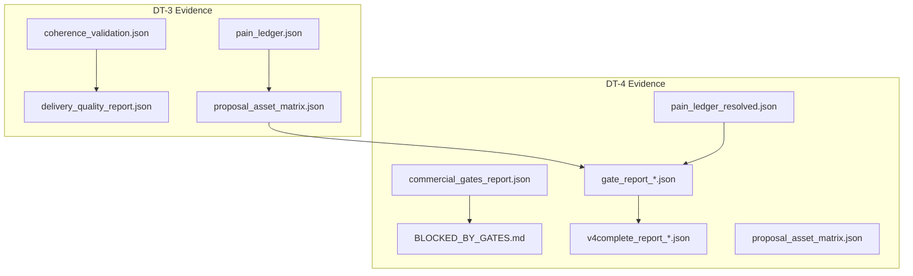
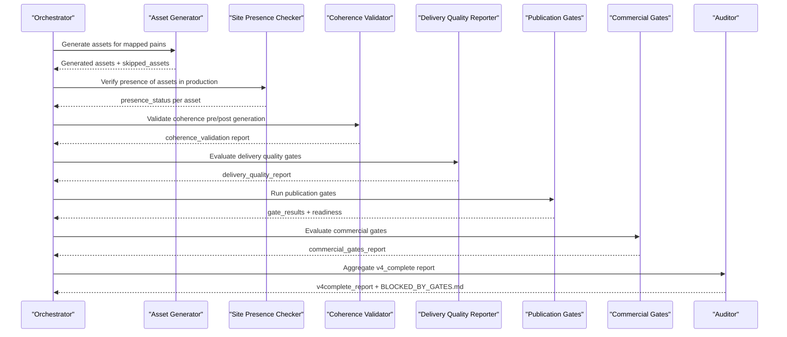
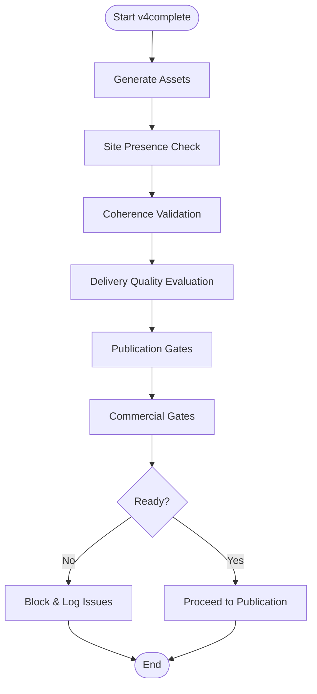

# Evidence Collection and Validation System

<cite>
**Referenced Files in This Document**
- [coherence_validation.json](file://plans/Archives/DT-3-TECH-DEBT-2026-07-25/evidence/coherence_validation.json)
- [delivery_quality_report.json](file://plans/Archives/DT-3-TECH-DEBT-2026-07-25/evidence/delivery_quality_report.json)
- [pain_ledger.json](file://plans/Archives/DT-3-TECH-DEBT-2026-07-25/evidence/pain_ledger.json)
- [proposal_asset_matrix.json](file://plans/Archives/DT-3-TECH-DEBT-2026-07-25/evidence/proposal_asset_matrix.json)
- [commercial_gates_report.json](file://plans/Archives/DT-4-ROOT-CAUSE-2026-07-25/evidence/commercial_gates_report.json)
- [BLOCKED_BY_GATES.md](file://plans/Archives/DT-4-ROOT-CAUSE-2026-07-25/evidence/BLOCKED_BY_GATES.md)
- [gate_report_20260727_140459.json](file://plans/Archives/DT-4-ROOT-CAUSE-2026-07-25/evidence/gate_report_20260727_140459.json)
- [v4complete_report_post_fix.json](file://plans/Archives/DT-4-ROOT-CAUSE-2026-07-25/evidence/v4complete_report_post_fix.json)
- [pain_ledger_resolved.json](file://plans/Archives/DT-4-ROOT-CAUSE-2026-07-25/evidence/pain_ledger_resolved.json)
- [proposal_asset_matrix.json](file://plans/Archives/DT-4-ROOT-CAUSE-2026-07-25/evidence/proposal_asset_matrix.json)
- [CONTEXT-DT-4.md](file://context/Historico/CONTEXT-DT-4.md)
- [CONTEXT-EVIDENCE-TIER-FALSE-CONFIDENCE-IAO-2026-07-30.md](file://context/CONTEXT-EVIDENCE-TIER-FALSE-CONFIDENCE-IAO-2026-07-30.md)
</cite>

## Table of Contents
1. Introduction
2. Project Structure
3. Core Components
4. Architecture Overview
5. Detailed Component Analysis
6. Dependency Analysis
7. Performance Considerations
8. Troubleshooting Guide
9. Conclusion
10. Appendices

## Introduction
This document explains the evidence collection and validation system that underpins both DT-3 and DT-4 methodologies. It describes how evidence is collected, stored, validated, and interpreted to support technical debt resolution and commercial decision-making. The system standardizes evidence via JSON schemas, enforces quality gates, and produces an audit trail that supports phase progression decisions.

Key objectives:
- Standardize evidence types across coherence validation, delivery quality, commercial gates, and pain ledgers.
- Provide a consistent schema for evidence representation and automated validation.
- Enable correlation between evidence sources to inform decisions on whether to proceed to the next phase.
- Ensure robust audit trails, retention policies, and integration with the broader quality assurance pipeline.

## Project Structure
Evidence artifacts are organized per project plan (e.g., DT-3, DT-4), each containing an evidence directory with standardized JSON reports and supporting documents. The structure enables traceability from detection through resolution and publication readiness.

**Diagram sources**
- [coherence_validation.json](file://plans/Archives/DT-3-TECH-DEBT-2026-07-25/evidence/coherence_validation.json)
- [delivery_quality_report.json](file://plans/Archives/DT-3-TECH-DEBT-2026-07-25/evidence/delivery_quality_report.json)
- [pain_ledger.json](file://plans/Archives/DT-3-TECH-DEBT-2026-07-25/evidence/pain_ledger.json)
- [proposal_asset_matrix.json](file://plans/Archives/DT-3-TECH-DEBT-2026-07-25/evidence/proposal_asset_matrix.json)
- [commercial_gates_report.json](file://plans/Archives/DT-4-ROOT-CAUSE-2026-07-25/evidence/commercial_gates_report.json)
- [BLOCKED_BY_GATES.md](file://plans/Archives/DT-4-ROOT-CAUSE-2026-07-25/evidence/BLOCKED_BY_GATES.md)
- [gate_report_20260727_140459.json](file://plans/Archives/DT-4-ROOT-CAUSE-2026-07-25/evidence/gate_report_20260727_140459.json)
- [v4complete_report_post_fix.json](file://plans/Archives/DT-4-ROOT-CAUSE-2026-07-25/evidence/v4complete_report_post_fix.json)
- [pain_ledger_resolved.json](file://plans/Archives/DT-4-ROOT-CAUSE-2026-07-25/evidence/pain_ledger_resolved.json)
- [proposal_asset_matrix.json](file://plans/Archives/DT-4-ROOT-CAUSE-2026-07-25/evidence/proposal_asset_matrix.json)

**Section sources**
- [coherence_validation.json](file://plans/Archives/DT-3-TECH-DEBT-2026-07-25/evidence/coherence_validation.json)
- [delivery_quality_report.json](file://plans/Archives/DT-3-TECH-DEBT-2026-07-25/evidence/delivery_quality_report.json)
- [pain_ledger.json](file://plans/Archives/DT-3-TECH-DEBT-2026-07-25/evidence/pain_ledger.json)
- [proposal_asset_matrix.json](file://plans/Archives/DT-3-TECH-DEBT-2026-07-25/evidence/proposal_asset_matrix.json)
- [commercial_gates_report.json](file://plans/Archives/DT-4-ROOT-CAUSE-2026-07-25/evidence/commercial_gates_report.json)
- [BLOCKED_BY_GATES.md](file://plans/Archives/DT-4-ROOT-CAUSE-2026-07-25/evidence/BLOCKED_BY_GATES.md)
- [gate_report_20260727_140459.json](file://plans/Archives/DT-4-ROOT-CAUSE-2026-07-25/evidence/gate_report_20260727_140459.json)
- [v4complete_report_post_fix.json](file://plans/Archives/DT-4-ROOT-CAUSE-2026-07-25/evidence/v4complete_report_post_fix.json)
- [pain_ledger_resolved.json](file://plans/Archives/DT-4-ROOT-CAUSE-2026-07-25/evidence/pain_ledger_resolved.json)
- [proposal_asset_matrix.json](file://plans/Archives/DT-4-ROOT-CAUSE-2026-07-25/evidence/proposal_asset_matrix.json)

## Core Components
The system revolves around four primary evidence types:
- Coherence Validation Report: Validates internal consistency of assets, financial data, and site signals.
- Delivery Quality Report: Evaluates asset generation coverage, alignment, specificity, and evidence availability.
- Commercial Gates Report: Assesses commercial viability and narrative quality; can block proposal generation.
- Pain Ledger: Tracks detected pains, their severity, confidence, and resolution status.

Additionally:
- Proposal Asset Matrix: Maps services/assets to pains and tracks alignment status.
- Gate Reports: Per-run publication gate results used to determine readiness.
- v4 Complete Report: Aggregates phases, modules, assets generated, financial scenarios, and readiness.

These components collectively ensure that evidence is coherent, complete, and actionable for phase progression.

**Section sources**
- [coherence_validation.json](file://plans/Archives/DT-3-TECH-DEBT-2026-07-25/evidence/coherence_validation.json)
- [delivery_quality_report.json](file://plans/Archives/DT-3-TECH-DEBT-2026-07-25/evidence/delivery_quality_report.json)
- [commercial_gates_report.json](file://plans/Archives/DT-4-ROOT-CAUSE-2026-07-25/evidence/commercial_gates_report.json)
- [pain_ledger.json](file://plans/Archives/DT-3-TECH-DEBT-2026-07-25/evidence/pain_ledger.json)
- [proposal_asset_matrix.json](file://plans/Archives/DT-3-TECH-DEBT-2026-07-25/evidence/proposal_asset_matrix.json)
- [gate_report_20260727_140459.json](file://plans/Archives/DT-4-ROOT-CAUSE-2026-07-25/evidence/gate_report_20260727_140459.json)
- [v4complete_report_post_fix.json](file://plans/Archives/DT-4-ROOT-CAUSE-2026-07-25/evidence/v4complete_report_post_fix.json)

## Architecture Overview
The evidence pipeline integrates multiple modules to produce standardized outputs and enforce quality gates.

**Diagram sources**
- [v4complete_report_post_fix.json](file://plans/Archives/DT-4-ROOT-CAUSE-2026-07-25/evidence/v4complete_report_post_fix.json)
- [gate_report_20260727_140459.json](file://plans/Archives/DT-4-ROOT-CAUSE-2026-07-25/evidence/gate_report_20260727_140459.json)
- [commercial_gates_report.json](file://plans/Archives/DT-4-ROOT-CAUSE-2026-07-25/evidence/commercial_gates_report.json)
- [delivery_quality_report.json](file://plans/Archives/DT-3-TECH-DEBT-2026-07-25/evidence/delivery_quality_report.json)
- [coherence_validation.json](file://plans/Archives/DT-3-TECH-DEBT-2026-07-25/evidence/coherence_validation.json)
- [BLOCKED_BY_GATES.md](file://plans/Archives/DT-4-ROOT-CAUSE-2026-07-25/evidence/BLOCKED_BY_GATES.md)

## Detailed Component Analysis

### Coherence Validation Report
Purpose:
- Assess internal consistency across checks such as problem-solution mapping, asset justification, financial data validity, WhatsApp verification, price-to-pain alignment, and promised asset existence.
- Produce a global score and per-check details with pass/fail, scores, messages, and severity.

Interpretation:
- A low score or failing checks indicates risks that must be addressed before proceeding.
- Specific failures (e.g., insufficient WhatsApp confidence) require targeted remediation.

Schema highlights:
- Top-level fields include overall coherence score, boolean coherence flag, timestamp, version, and arrays of checks, errors, and warnings.
- Each check includes name, passed, score, message, and severity.

Example interpretation:
- If a check fails due to insufficient confidence, prioritize improving data inputs or validations.
- Warnings may indicate borderline cases requiring human review.

**Section sources**
- [coherence_validation.json](file://plans/Archives/DT-3-TECH-DEBT-2026-07-25/evidence/coherence_validation.json)

### Delivery Quality Report
Purpose:
- Evaluate asset generation coverage, proposal-asset alignment, asset specificity, and evidence availability.
- Determine blocking vs advisory outcomes and summarize gate statuses.

Interpretation:
- Blocking gates prevent delivery; non-blocking gates suggest improvements.
- Coverage and alignment metrics guide whether assets meet thresholds and promise fidelity.

Schema highlights:
- Status and blocking flags at top level.
- Gate-specific sections with pass/fail, details, and gate identifiers.
- Summary aggregating total gates, pass/fail counts, coherence score, and blocking/warning lists.

Example interpretation:
- A failed proposal-asset alignment gate suggests missing or misaligned assets; investigate asset generation and mapping.
- Advisory warnings should be reviewed but do not block progress unless they escalate.

**Section sources**
- [delivery_quality_report.json](file://plans/Archives/DT-3-TECH-DEBT-2026-07-25/evidence/delivery_quality_report.json)

### Commercial Gates Report
Purpose:
- Assess commercial viability and narrative quality, including ROI arguments, OTA terminology usage, and technical jargon in management-facing content.
- Can block proposal generation when critical commercial criteria fail.

Interpretation:
- Blocking failures require restructure of offer or narrative before proceeding.
- Warnings indicate areas for improvement without immediate blockage.

Schema highlights:
- all_passed and blocking_passed flags.
- Results array with gate_id, name, passed, severity, message, suggestion.
- Summary string consolidating blocking and warning counts.

Example interpretation:
- Negative ROI without alternative onboarding plan blocks proposal; restructure pricing or phases.
- Technical jargon in management view should be moved to technical annexes.

**Section sources**
- [commercial_gates_report.json](file://plans/Archives/DT-4-ROOT-CAUSE-2026-07-25/evidence/commercial_gates_report.json)

### Pain Ledger
Purpose:
- Track detected pains with confidence, severity, source module, and status transitions (e.g., DETECTED → MAPPED_TO_SERVICE → ASSET_GENERATED).
- Serves as a central record for pain resolution tracking and coverage evaluation.

Interpretation:
- High-severity pains with low confidence need stronger evidence or manual validation.
- Status transitions reflect progress toward resolution; unresolved pains block coverage gates.

Schema highlights:
- Entries array with confidence, evidence_refs, human_label, pain_id, severity, source_file, source_module, status.
- Version field for ledger schema evolution.

Example interpretation:
- A pain marked ASSET_GENERATED indicates an asset was produced to address it; verify alignment with proposal.
- Uncovered pains require inclusion in diagnosis, justification, or proposal.

**Section sources**
- [pain_ledger.json](file://plans/Archives/DT-3-TECH-DEBT-2026-07-25/evidence/pain_ledger.json)
- [pain_ledger_resolved.json](file://plans/Archives/DT-4-ROOT-CAUSE-2026-07-25/evidence/pain_ledger_resolved.json)

### Proposal Asset Matrix
Purpose:
- Map services/assets to pains and track alignment status (LINKED, MISSING_ASSET, NO_BREACH).
- Supports delivery readiness assessment and alignment counting.

Interpretation:
- MISSING_ASSET entries indicate gaps between promises and deliverables.
- NO_BREACH entries imply no pain addressed by that asset; may be excluded from alignment counts depending on product policy.

Schema highlights:
- alignment_status_version, delivery_ready flag, entries array.
- Each entry includes alignment, asset_path, asset_type, confidence, pain_ids, service_name, status.

Example interpretation:
- Align missing assets with proposal promises; if already present in production, mark accordingly.
- Exclude non-pain-driven assets (e.g., monthly report) from alignment counts per product decision.

**Section sources**
- [proposal_asset_matrix.json](file://plans/Archives/DT-3-TECH-DEBT-2026-07-25/evidence/proposal_asset_matrix.json)
- [proposal_asset_matrix.json](file://plans/Archives/DT-4-ROOT-CAUSE-2026-07-25/evidence/proposal_asset_matrix.json)

### Gate Reports and Readiness
Purpose:
- Capture per-run publication gate results, including evidence coverage, coherence, asset confidence, and tier requirements.
- Determine readiness status and list blocking issues and warnings.

Interpretation:
- Readiness NOT_READY indicates unresolved blocking issues; resolve listed gates before re-execution.
- Financial validity warnings may lower evidence tier; improve data sources for higher tiers.

Schema highlights:
- generated_at, hotel_url, gate_results array with gate_name, passed, status, message, value, suggestion, details.
- readiness object with status, ready flag, blocking_issues, warnings.
- financial_sources indicating data provenance.

Example interpretation:
- A failed coverage_no_silent_drop gate requires adding uncovered pains to diagnosis, justification, or proposal.
- Tier B indicates sufficient data for active proposal; aim for Tier A by connecting GA4/GSC.

**Section sources**
- [gate_report_20260727_140459.json](file://plans/Archives/DT-4-ROOT-CAUSE-2026-07-25/evidence/gate_report_20260727_140459.json)

### v4 Complete Report
Purpose:
- Aggregate execution metadata, phases, modules used, coherence score, generated assets, financial scenarios, SEO score, pricing, analytics status, opportunity scores, and channel context.
- Provides a comprehensive snapshot for post-fix verification and auditing.

Interpretation:
- Phase completion and readiness indicate whether the process reached publication.
- Asset generation details and confidence scores help assess output quality.
- Financial scenarios and expected monthly values inform commercial viability.

Schema highlights:
- v4_complete flag, hotel metadata, phases object, modules_used, coherence_score, assets_generated, financial_data, seo_score, pricing, analytics, opportunity_scores, channel_context.

Example interpretation:
- If publication gates show NOT_READY, focus on blocking issues listed in phase_4_publication_gates.
- Opportunity scores rank pains by impact and effort; prioritize high-scoring items.

**Section sources**
- [v4complete_report_post_fix.json](file://plans/Archives/DT-4-ROOT-CAUSE-2026-07-25/evidence/v4complete_report_post_fix.json)

### Blocked By Gates Document
Purpose:
- Summarize why publication was blocked, listing failed gates and commercial gate blockers.
- Guides corrective actions and prevents misleading re-execution instructions.

Interpretation:
- Review failed gates and commercial gate messages to understand root causes.
- Resolve blocking issues before re-running; avoid identical re-executions when commercial gates remain unaddressed.

Schema highlights:
- Date, hotel, URL, status, failed gates with messages and suggestions, commercial gates section.

Example interpretation:
- If commercial gates block due to negative ROI, restructure offer or add quick wins before re-execution.

**Section sources**
- [BLOCKED_BY_GATES.md](file://plans/Archives/DT-4-ROOT-CAUSE-2026-07-25/evidence/BLOCKED_BY_GATES.md)

## Dependency Analysis
Evidence components interact through well-defined contracts and flows:
- Orchestrator coordinates asset generation, site presence checks, coherence validation, delivery quality, publication gates, and commercial gates.
- Pain ledger serves as a central truth for pain resolution; reconciled state improves coverage and alignment accuracy.
- Gate reports aggregate results to determine readiness and block/unblock progression.

**Diagram sources**
- [v4complete_report_post_fix.json](file://plans/Archives/DT-4-ROOT-CAUSE-2026-07-25/evidence/v4complete_report_post_fix.json)
- [gate_report_20260727_140459.json](file://plans/Archives/DT-4-ROOT-CAUSE-2026-07-25/evidence/gate_report_20260727_140459.json)
- [commercial_gates_report.json](file://plans/Archives/DT-4-ROOT-CAUSE-2026-07-25/evidence/commercial_gates_report.json)

**Section sources**
- [v4complete_report_post_fix.json](file://plans/Archives/DT-4-ROOT-CAUSE-2026-07-25/evidence/v4complete_report_post_fix.json)
- [gate_report_20260727_140459.json](file://plans/Archives/DT-4-ROOT-CAUSE-2026-07-25/evidence/gate_report_20260727_140459.json)
- [commercial_gates_report.json](file://plans/Archives/DT-4-ROOT-CAUSE-2026-07-25/evidence/commercial_gates_report.json)

## Performance Considerations
- Minimize redundant computations by caching intermediate results (e.g., site presence checks).
- Optimize gate evaluations to run once per execution and derive readiness from cached results.
- Use efficient JSON serialization and selective field inclusion for large reports.
- Prioritize high-impact checks first to fail fast when blocking conditions exist.

[No sources needed since this section provides general guidance]

## Troubleshooting Guide
Common issues and resolutions:
- Coverage gate failure due to uncovered pains: Add uncovered pains to diagnosis, justify skip/block/mapped_to_service, or include in proposal.
- Commercial gates blocking proposal: Restructure offer, separate diagnostic/onboarding phases, recalculate ROI with real evidence, or propose low-risk initial phase.
- Coherence validation failures: Improve data inputs, validate WhatsApp confidence against site presence, ensure promised assets exist.
- Readiness NOT_READY: Resolve all blocking issues listed in gate reports and BLOCKED_BY_GATES.md before re-execution.

**Section sources**
- [gate_report_20260727_140459.json](file://plans/Archives/DT-4-ROOT-CAUSE-2026-07-25/evidence/gate_report_20260727_140459.json)
- [BLOCKED_BY_GATES.md](file://plans/Archives/DT-4-ROOT-CAUSE-2026-07-25/evidence/BLOCKED_BY_GATES.md)
- [commercial_gates_report.json](file://plans/Archives/DT-4-ROOT-CAUSE-2026-07-25/evidence/commercial_gates_report.json)

## Conclusion
The evidence collection and validation system provides a structured, auditable, and automated approach to technical debt resolution across DT-3 and DT-4. By standardizing evidence types, enforcing quality gates, and correlating multiple data sources, the system ensures reliable decision-making for phase progression. Continuous improvement focuses on reconciling evidence sources, enhancing commercial gate visibility, and refining coherence and coverage checks.

[No sources needed since this section summarizes without analyzing specific files]

## Appendices

### Evidence Schema Reference
- Coherence Validation Report:
  - Fields: is_coherent, overall_score, checks[], errors[], warnings[], timestamp, version.
  - Checks include name, passed, score, message, severity.
- Delivery Quality Report:
  - Fields: status, blocking, coverage_gate, proposal_asset_gate, asset_specificity_gate, evidence_gate, advisory_warnings, human_review_items, summary.
- Commercial Gates Report:
  - Fields: all_passed, blocking_passed, results[], summary.
  - Results include gate_id, name, passed, severity, message, suggestion.
- Pain Ledger:
  - Fields: entries[], pain_ledger_version.
  - Entries include confidence, evidence_refs, human_label, pain_id, severity, source_file, source_module, status.
- Proposal Asset Matrix:
  - Fields: alignment_status_version, delivery_ready, entries[].
  - Entries include alignment, asset_path, asset_type, confidence, pain_ids, service_name, status.
- Gate Report:
  - Fields: generated_at, hotel_url, gate_results[], readiness, financial_sources.
  - gate_results include gate_name, passed, status, message, value, suggestion, details.
- v4 Complete Report:
  - Fields: v4_complete, hotel_name, url, region, hotel_id, phases, modules_used, coherence_score, assets_generated, financial_data, seo_score, pricing, analytics, opportunity_scores, channel_context.

**Section sources**
- [coherence_validation.json](file://plans/Archives/DT-3-TECH-DEBT-2026-07-25/evidence/coherence_validation.json)
- [delivery_quality_report.json](file://plans/Archives/DT-3-TECH-DEBT-2026-07-25/evidence/delivery_quality_report.json)
- [commercial_gates_report.json](file://plans/Archives/DT-4-ROOT-CAUSE-2026-07-25/evidence/commercial_gates_report.json)
- [pain_ledger.json](file://plans/Archives/DT-3-TECH-DEBT-2026-07-25/evidence/pain_ledger.json)
- [proposal_asset_matrix.json](file://plans/Archives/DT-3-TECH-DEBT-2026-07-25/evidence/proposal_asset_matrix.json)
- [gate_report_20260727_140459.json](file://plans/Archives/DT-4-ROOT-CAUSE-2026-07-25/evidence/gate_report_20260727_140459.json)
- [v4complete_report_post_fix.json](file://plans/Archives/DT-4-ROOT-CAUSE-2026-07-25/evidence/v4complete_report_post_fix.json)

### Audit Trail and Retention Policies
- All evidence artifacts are timestamped and versioned to maintain historical traceability.
- Retain gate reports, coherence validations, delivery quality reports, commercial gates reports, and pain ledgers per project lifecycle.
- Store BLOCKED_BY_GATES.md alongside gate reports for quick diagnostics.
- Archive v4 complete reports for post-release analysis and compliance.

**Section sources**
- [gate_report_20260727_140459.json](file://plans/Archives/DT-4-ROOT-CAUSE-2026-07-25/evidence/gate_report_20260727_140459.json)
- [BLOCKED_BY_GATES.md](file://plans/Archives/DT-4-ROOT-CAUSE-2026-07-25/evidence/BLOCKED_BY_GATES.md)
- [v4complete_report_post_fix.json](file://plans/Archives/DT-4-ROOT-CAUSE-2026-07-25/evidence/v4complete_report_post_fix.json)

### Integration with Quality Assurance Pipeline
- Evidence artifacts integrate with pytest suites to validate gate logic and schema integrity.
- Pre-commit hooks enforce version consistency and synchronization across modules.
- v4complete execution serves as E2E verification for fixes and changes.

**Section sources**
- [CONTEXT-DT-4.md](file://context/Historico/CONTEXT-DT-4.md)
- [CONTEXT-EVIDENCE-TIER-FALSE-CONFIDENCE-IAO-2026-07-30.md](file://context/CONTEXT-EVIDENCE-TIER-FALSE-CONFIDENCE-IAO-2026-07-30.md)