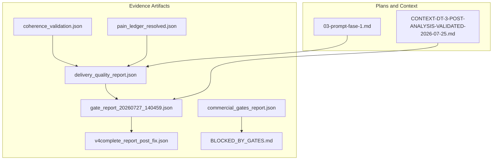
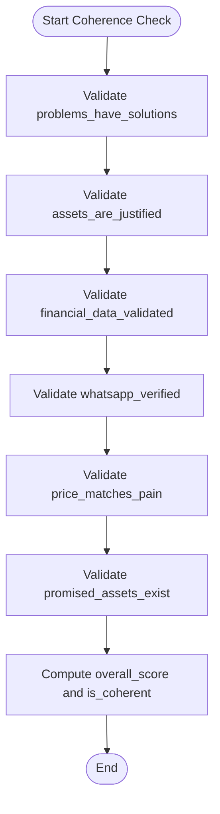
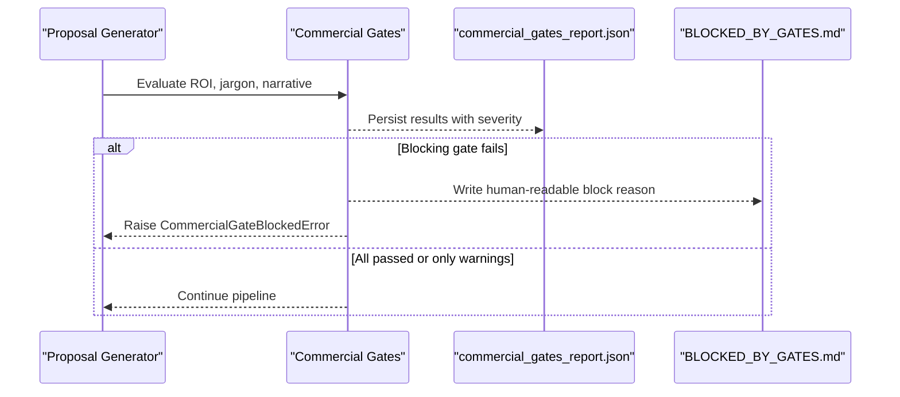
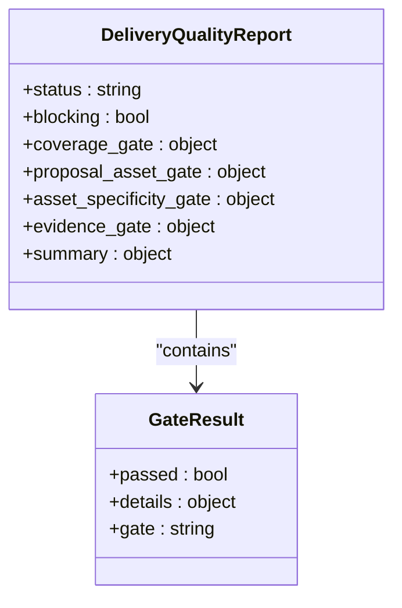
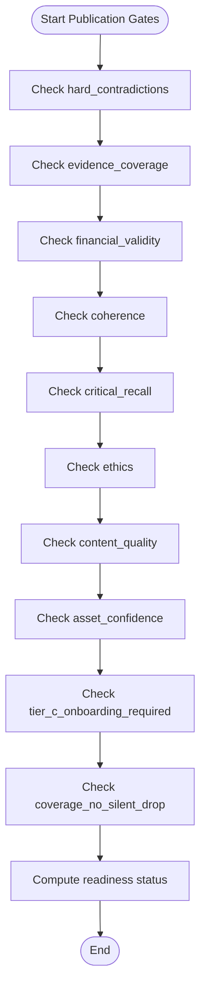
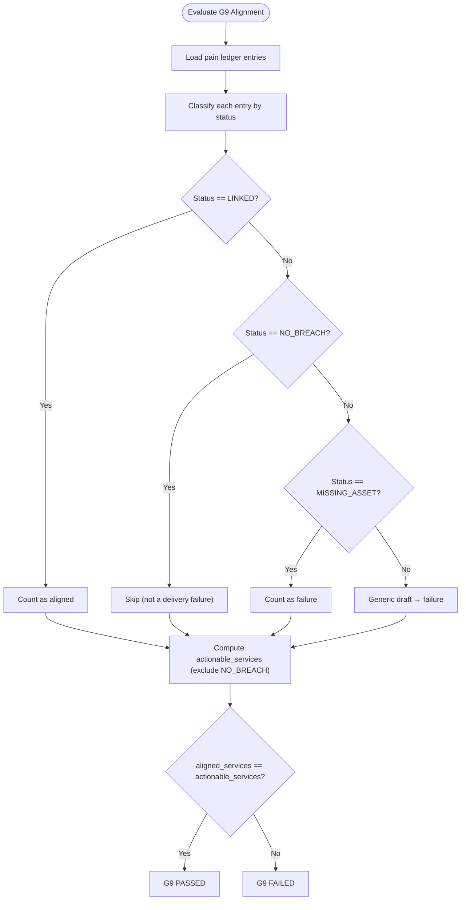
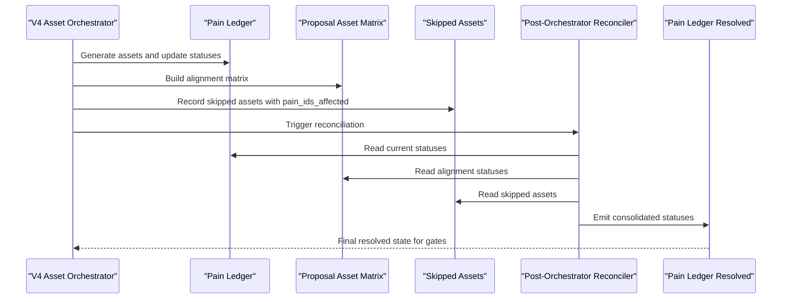
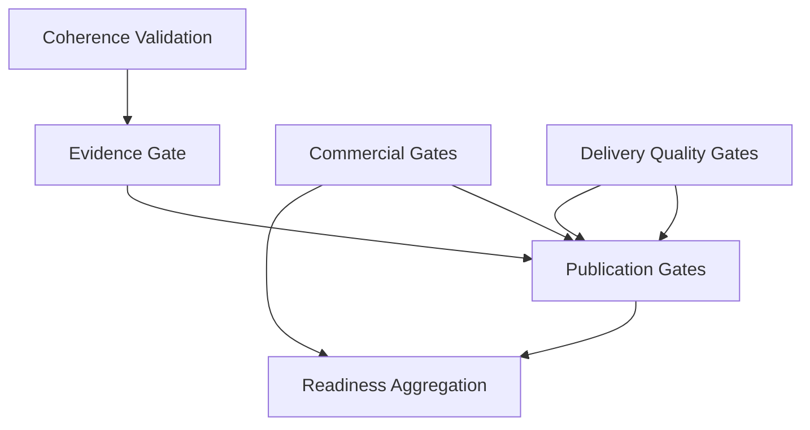

# Quality Gates Integration and Validation

<cite>
**Referenced Files in This Document**
- [coherence_validation.json](file://plans/Archives/DT-3-TECH-DEBT-2026-07-25/evidence/coherence_validation.json)
- [delivery_quality_report.json](file://plans/Archives/DT-3-TECH-DEBT-2026-07-25/evidence/delivery_quality_report.json)
- [BLOCKED_BY_GATES.md](file://plans/Archives/DT-4-ROOT-CAUSE-2026-07-25/evidence/BLOCKED_BY_GATES.md)
- [commercial_gates_report.json](file://plans/Archives/DT-4-ROOT-CAUSE-2026-07-25/evidence/commercial_gates_report.json)
- [gate_report_20260727_140459.json](file://plans/Archives/DT-4-ROOT-CAUSE-2026-07-25/evidence/gate_report_20260727_140459.json)
- [v4complete_report_post_fix.json](file://plans/Archives/DT-4-ROOT-CAUSE-2026-07-25/evidence/v4complete_report_post_fix.json)
- [pain_ledger_resolved.json](file://plans/Archives/DT-4-ROOT-CAUSE-2026-07-25/evidence/pain_ledger_resolved.json)
- [CONTEXT-DT-3-POST-ANALYSIS-VALIDATED-2026-07-25.md](file://context/Historico/CONTEXT-DT-3-POST-ANALYSIS-VALIDATED-2026-07-25.md)
- [03-prompt-fase-1.md](file://plans/Archives/DT-3-TECH-DEBT-2026-07-25/03-prompt-fase-1.md)
</cite>

## Table of Contents
1. [Introduction](#introduction)
2. [Project Structure](#project-structure)
3. [Core Components](#core-components)
4. [Architecture Overview](#architecture-overview)
5. [Detailed Component Analysis](#detailed-component-analysis)
6. [Dependency Analysis](#dependency-analysis)
7. [Performance Considerations](#performance-considerations)
8. [Troubleshooting Guide](#troubleshooting-guide)
9. [Conclusion](#conclusion)
10. [Appendices](#appendices)

## Introduction
This document explains the quality gates integration system that validates technical debt resolutions and ensures system stability across coherence, commercial viability, and delivery quality. It details the multi-layered gate architecture, how G9 dual-list issues were resolved, and how status-based evaluation prevents false positives in asset validation. It also covers gate configuration, thresholds, the relationship between blocking and warning gates, report interpretation, failure analysis, reconciliation processes, forensic capabilities, and CI/CD integration points.

## Project Structure
The evidence and plans for the quality gates system are organized under:
- Evidence artifacts (JSON reports, markdown logs) produced by v4complete runs and gate evaluations
- Plan documents describing fixes, phases, and rationale for gate behavior changes

Key directories:
- plans/Archives/.../evidence: Contains gate reports, coherence validations, commercial gate results, and post-fix summaries
- context/Historico: Post-analysis and validated context explaining root causes and recommended fixes

**Diagram sources**
- [coherence_validation.json](file://plans/Archives/DT-3-TECH-DEBT-2026-07-25/evidence/coherence_validation.json)
- [delivery_quality_report.json](file://plans/Archives/DT-3-TECH-DEBT-2026-07-25/evidence/delivery_quality_report.json)
- [commercial_gates_report.json](file://plans/Archives/DT-4-ROOT-CAUSE-2026-07-25/evidence/commercial_gates_report.json)
- [gate_report_20260727_140459.json](file://plans/Archives/DT-4-ROOT-CAUSE-2026-07-25/evidence/gate_report_20260727_140459.json)
- [v4complete_report_post_fix.json](file://plans/Archives/DT-4-ROOT-CAUSE-2026-07-25/evidence/v4complete_report_post_fix.json)
- [pain_ledger_resolved.json](file://plans/Archives/DT-4-ROOT-CAUSE-2026-07-25/evidence/pain_ledger_resolved.json)
- [BLOCKED_BY_GATES.md](file://plans/Archives/DT-4-ROOT-CAUSE-2026-07-25/evidence/BLOCKED_BY_GATES.md)
- [03-prompt-fase-1.md](file://plans/Archives/DT-3-TECH-DEBT-2026-07-25/03-prompt-fase-1.md)
- [CONTEXT-DT-3-POST-ANALYSIS-VALIDATED-2026-07-25.md](file://context/Historico/CONTEXT-DT-3-POST-ANALYSIS-VALIDATED-2026-07-25.md)

**Section sources**
- [coherence_validation.json](file://plans/Archives/DT-3-TECH-DEBT-2026-07-25/evidence/coherence_validation.json)
- [delivery_quality_report.json](file://plans/Archives/DT-3-TECH-DEBT-2026-07-25/evidence/delivery_quality_report.json)
- [commercial_gates_report.json](file://plans/Archives/DT-4-ROOT-CAUSE-2026-07-25/evidence/commercial_gates_report.json)
- [gate_report_20260727_140459.json](file://plans/Archives/DT-4-ROOT-CAUSE-2026-07-25/evidence/gate_report_20260727_140459.json)
- [v4complete_report_post_fix.json](file://plans/Archives/DT-4-ROOT-CAUSE-2026-07-25/evidence/v4complete_report_post_fix.json)
- [pain_ledger_resolved.json](file://plans/Archives/DT-4-ROOT-CAUSE-2026-07-25/evidence/pain_ledger_resolved.json)
- [BLOCKED_BY_GATES.md](file://plans/Archives/DT-4-ROOT-CAUSE-2026-07-25/evidence/BLOCKED_BY_GATES.md)
- [03-prompt-fase-1.md](file://plans/Archives/DT-3-TECH-DEBT-2026-07-25/03-prompt-fase-1.md)
- [CONTEXT-DT-3-POST-ANALYSIS-VALIDATED-2026-07-25.md](file://context/Historico/CONTEXT-DT-3-POST-ANALYSIS-VALIDATED-2026-07-25.md)

## Core Components
- Coherence validation: Assesses overall consistency and confidence across checks such as problem-solution mapping, asset justification, financial data validity, WhatsApp verification, price alignment, and promised assets existence.
- Commercial gates: Evaluate business viability and narrative quality (e.g., ROI negativity, technical jargon in management view).
- Delivery quality gates: Validate coverage, asset specificity, evidence availability, and proposal-asset alignment (G9).
- Publication gates: Enforce coverage without silent drops, critical recall, ethics, content quality, and asset confidence.

Key outputs:
- coherence_validation.json: Per-check scores and pass/fail with severity
- delivery_quality_report.json: Gate-level pass/fail, summary, and blocking/warning classification
- commercial_gates_report.json: Gate results with severity and suggestions
- gate_report_*.json: Detailed publication gate results including readiness and warnings
- BLOCKED_BY_GATES.md: Human-readable block reasons and actions

**Section sources**
- [coherence_validation.json](file://plans/Archives/DT-3-TECH-DEBT-2026-07-25/evidence/coherence_validation.json)
- [delivery_quality_report.json](file://plans/Archives/DT-3-TECH-DEBT-2026-07-25/evidence/delivery_quality_report.json)
- [commercial_gates_report.json](file://plans/Archives/DT-4-ROOT-CAUSE-2026-07-25/evidence/commercial_gates_report.json)
- [gate_report_20260727_140459.json](file://plans/Archives/DT-4-ROOT-CAUSE-2026-07-25/evidence/gate_report_20260727_140459.json)
- [BLOCKED_BY_GATES.md](file://plans/Archives/DT-4-ROOT-CAUSE-2026-07-25/evidence/BLOCKED_BY_GATES.md)

## Architecture Overview
The quality gates system integrates multiple layers to ensure robustness:
- Coherence layer: Validates internal consistency and confidence thresholds
- Commercial layer: Ensures proposals are commercially viable and appropriately worded
- Delivery layer: Confirms generated assets meet specificity and alignment requirements
- Publication layer: Enforces coverage, evidence, and content standards before release

```mermaid
graph TB
subgraph "Coherence Layer"
C1["problems_have_solutions"]
C2["assets_are_justified"]
C3["financial_data_validated"]
C4["whatsapp_verified"]
C5["price_matches_pain"]
C6["promised_assets_exist"]
end
subgraph "Commercial Layer"
M1["CG-ROI-NEGATIVE"]
M2["CG-TECH-JARGON"]
M3["CG-OTA-NARRATIVE"]
end
subgraph "Delivery Layer"
D1["coverage_gate (G7)"]
D2["proposal_asset_alignment (G9)"]
D3["asset_specificity_gate (G8)"]
D4["evidence_gate"]
end
subgraph "Publication Layer"
P1["hard_contradictions"]
P2["evidence_coverage"]
P3["financial_validity"]
P4["coherence"]
P5["critical_recall"]
P6["ethics"]
P7["content_quality"]
P8["asset_confidence"]
P9["tier_c_onboarding_required"]
P10["coverage_no_silent_drop"]
end
C1 --> D4
C2 --> D4
C3 --> D4
C4 --> D4
C5 --> D4
C6 --> D4
M1 --> P10
M2 --> P10
M3 --> P10
D1 --> P10
D2 --> P10
D3 --> P10
D4 --> P10
P1 --> P10
P2 --> P10
P3 --> P10
P4 --> P10
P5 --> P10
P6 --> P10
P7 --> P10
P8 --> P10
P9 --> P10
```

**Diagram sources**
- [coherence_validation.json](file://plans/Archives/DT-3-TECH-DEBT-2026-07-25/evidence/coherence_validation.json)
- [delivery_quality_report.json](file://plans/Archives/DT-3-TECH-DEBT-2026-07-25/evidence/delivery_quality_report.json)
- [commercial_gates_report.json](file://plans/Archives/DT-4-ROOT-CAUSE-2026-07-25/evidence/commercial_gates_report.json)
- [gate_report_20260727_1407_140459.json](file://plans/Archives/DT-4-ROOT-CAUSE-2026-07-25/evidence/gate_report_20260727_140459.json)

## Detailed Component Analysis

### Coherence Validation
- Checks include problem-solution mapping, asset justification, financial data validation, WhatsApp verification, price alignment, and promised assets existence
- Scores per check determine pass/fail and severity; overall score influences readiness
- Example: whatsapp_verified may fail due to low confidence, requiring higher threshold

**Diagram sources**
- [coherence_validation.json](file://plans/Archives/DT-3-TECH-DEBT-2026-07-25/evidence/coherence_validation.json)

**Section sources**
- [coherence_validation.json](file://plans/Archives/DT-3-TECH-DEBT-2026-07-25/evidence/coherence_validation.json)

### Commercial Gates
- Evaluate ROI negativity, technical jargon usage, and OTA narrative presence
- Blocking gates prevent proposal generation if commercial viability is compromised
- Warning gates flag areas needing improvement but do not block

**Diagram sources**
- [commercial_gates_report.json](file://plans/Archives/DT-4-ROOT-CAUSE-2026-07-25/evidence/commercial_gates_report.json)
- [BLOCKED_BY_GATES.md](file://plans/Archives/DT-4-ROOT-CAUSE-2026-07-25/evidence/BLOCKED_BY_GATES.md)

**Section sources**
- [commercial_gates_report.json](file://plans/Archives/DT-4-ROOT-CAUSE-2026-07-25/evidence/commercial_gates_report.json)
- [BLOCKED_BY_GATES.md](file://plans/Archives/DT-4-ROOT-CAUSE-2026-07-25/evidence/BLOCKED_BY_GATES.md)

### Delivery Quality Gates (G7, G8, G9, Evidence)
- G7 coverage: Ensures generated assets meet failure rate thresholds
- G8 asset specificity: Validates average confidence and threshold compliance
- G9 proposal-asset alignment: Ensures promised services have aligned assets; previously had dual-list and status-evaluation bugs
- Evidence gate: Confirms coherence and asset data availability

**Diagram sources**
- [delivery_quality_report.json](file://plans/Archives/DT-3-TECH-DEBT-2026-07-25/evidence/delivery_quality_report.json)

**Section sources**
- [delivery_quality_report.json](file://plans/Archives/DT-3-TECH-DEBT-2026-07-25/evidence/delivery_quality_report.json)

### Publication Gates
- Enforce hard contradictions, evidence coverage, financial validity, coherence, critical recall, ethics, content quality, asset confidence, tier onboarding requirements, and coverage without silent drops
- Readiness status aggregates failures and warnings

**Diagram sources**
- [gate_report_20260727_140459.json](file://plans/Archives/DT-4-ROOT-CAUSE-2026-07-25/evidence/gate_report_20260727_140459.json)

**Section sources**
- [gate_report_20260727_140459.json](file://plans/Archives/DT-4-ROOT-CAUSE-2026-07-25/evidence/gate_report_20260727_140459.json)

### G9 Dual-List Issues and Status-Based Evaluation
- BUG-2 (dual-list): G9 appeared in both blocking and warning lists due to inconsistent exclusion tuple; fixed by centralizing blocking gate names
- BUG-3 (status-based eval): G9 evaluated asset_path instead of entry status, causing false positives for NO_BREACH vs MISSING_ASSET; fixed by evaluating status semantics

**Diagram sources**
- [03-prompt-fase-1.md](file://plans/Archives/DT-3-TECH-DEBT-2026-07-25/03-prompt-fase-1.md)
- [delivery_quality_report.json](file://plans/Archives/DT-3-TECH-DEBT-2026-07-25/evidence/delivery_quality_report.json)

**Section sources**
- [03-prompt-fase-1.md](file://plans/Archives/DT-3-TECH-DEBT-2026-07-25/03-prompt-fase-1.md)
- [delivery_quality_report.json](file://plans/Archives/DT-3-TECH-DEBT-2026-07-25/evidence/delivery_quality_report.json)

### Reconciliation Process
- Multiple sources of truth (pain_ledger, proposal_asset_matrix, skipped_assets) must be reconciled into a single resolved state
- Post-orchestrator reconciler consolidates statuses to avoid conflicts and false positives

**Diagram sources**
- [pain_ledger_resolved.json](file://plans/Archives/DT-4-ROOT-CAUSE-2026-07-25/evidence/pain_ledger_resolved.json)
- [CONTEXT-DT-3-POST-ANALYSIS-VALIDATED-2026-07-25.md](file://context/Historico/CONTEXT-DT-3-POST-ANALYSIS-VALIDATED-2026-07-25.md)

**Section sources**
- [pain_ledger_resolved.json](file://plans/Archives/DT-4-ROOT-CAUSE-2026-07-25/evidence/pain_ledger_resolved.json)
- [CONTEXT-DT-3-POST-ANALYSIS-VALIDATED-2026-07-25.md](file://context/Historico/CONTEXT-DT-3-POST-ANALYSIS-VALIDATED-2026-07-25.md)

## Dependency Analysis
- Coherence validation feeds into evidence gate and publication coherence checks
- Commercial gates influence readiness and can block publication
- Delivery quality gates depend on asset generation and alignment matrices
- Publication gates aggregate all prior validations to determine final readiness

**Diagram sources**
- [coherence_validation.json](file://plans/Archives/DT-3-TECH-DEBT-2026-07-25/evidence/coherence_validation.json)
- [delivery_quality_report.json](file://plans/Archives/DT-3-TECH-DEBT-2026-07-25/evidence/delivery_quality_report.json)
- [commercial_gates_report.json](file://plans/Archives/DT-4-ROOT-CAUSE-2026-07-25/evidence/commercial_gates_report.json)
- [gate_report_20260727_140459.json](file://plans/Archives/DT-4-ROOT-CAUSE-2026-07-25/evidence/gate_report_20260727_140459.json)

**Section sources**
- [coherence_validation.json](file://plans/Archives/DT-3-TECH-DEBT-2026-07-25/evidence/coherence_validation.json)
- [delivery_quality_report.json](file://plans/Archives/DT-3-TECH-DEBT-2026-07-25/evidence/delivery_quality_report.json)
- [commercial_gates_report.json](file://plans/Archives/DT-4-ROOT-CAUSE-2026-07-25/evidence/commercial_gates_report.json)
- [gate_report_20260727_140459.json](file://plans/Archives/DT-4-ROOT-CAUSE-2026-07-25/evidence/gate_report_20260727_140459.json)

## Performance Considerations
- Minimize redundant evaluations by leveraging reconciled states from post-orchestrator
- Cache coherence scores and asset confidence metrics to avoid recomputation
- Optimize JSON parsing for large gate reports by streaming where possible
- Use early exits in gate evaluations when blocking conditions are met

[No sources needed since this section provides general guidance]

## Troubleshooting Guide
Common issues and resolutions:
- G9 dual-list: Ensure blocking gate names are centralized and consistently applied
- False positives in asset validation: Evaluate entry status rather than asset_path presence
- Commercial gate blocks: Review ROI and jargon issues; adjust proposal narrative
- Coverage failures: Justify uncovered pains or map them to services/assets
- Readiness not achieved: Aggregate failures and warnings from all gate layers

Forensic analysis steps:
- Inspect coherence_validation.json for low-confidence checks
- Review delivery_quality_report.json for specific gate failures
- Analyze commercial_gates_report.json for blocking warnings
- Examine gate_report_*.json for detailed publication gate outcomes
- Use BLOCKED_BY_GATES.md for human-readable block reasons

**Section sources**
- [coherence_validation.json](file://plans/Archives/DT-3-TECH-DEBT-2026-07-25/evidence/coherence_validation.json)
- [delivery_quality_report.json](file://plans/Archives/DT-3-TECH-DEBT-2026-07-25/evidence/delivery_quality_report.json)
- [commercial_gates_report.json](file://plans/Archives/DT-4-ROOT-CAUSE-2026-07-25/evidence/commercial_gates_report.json)
- [gate_report_20260727_140459.json](file://plans/Archives/DT-4-ROOT-CAUSE-2026-07-25/evidence/gate_report_20260727_140459.json)
- [BLOCKED_BY_GATES.md](file://plans/Archives/DT-4-ROOT-CAUSE-2026-07-25/evidence/BLOCKED_BY_GATES.md)

## Conclusion
The quality gates integration system provides a robust, multi-layered approach to validating technical debt resolutions and ensuring system stability. By addressing G9 dual-list issues and implementing status-based evaluation, false positives are minimized. The reconciliation process ensures consistent states across multiple sources of truth. Forensic analysis capabilities enable effective troubleshooting, while CI/CD integration automates quality assurance throughout the pipeline.

[No sources needed since this section summarizes without analyzing specific files]

## Appendices
- Gate configuration examples and threshold definitions are embedded within the evidence artifacts
- CI/CD integration points are reflected in the automated generation of gate reports and readiness status
- Best practices include centralizing gate configurations, using status-based evaluations, and maintaining clear reconciliation processes

[No sources needed since this section provides general guidance]