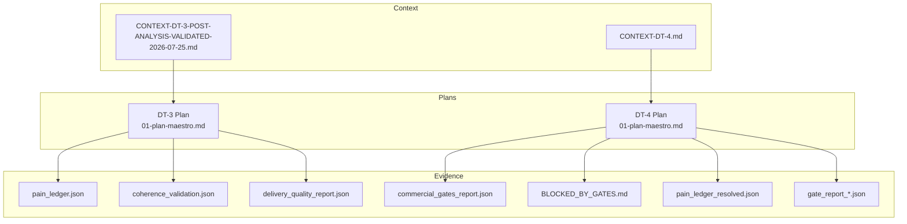
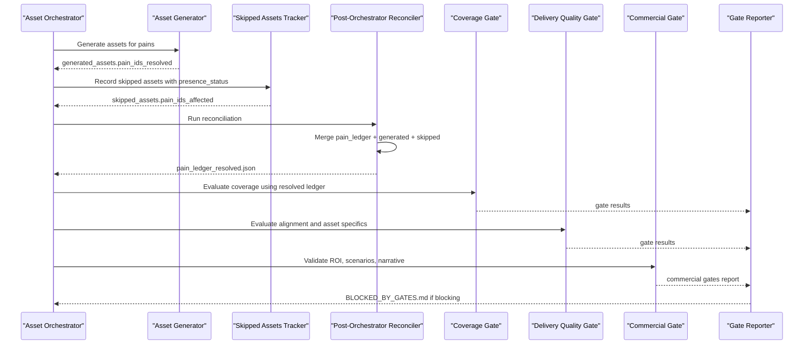
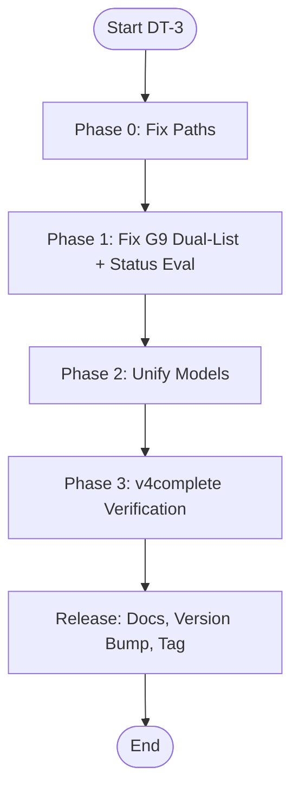
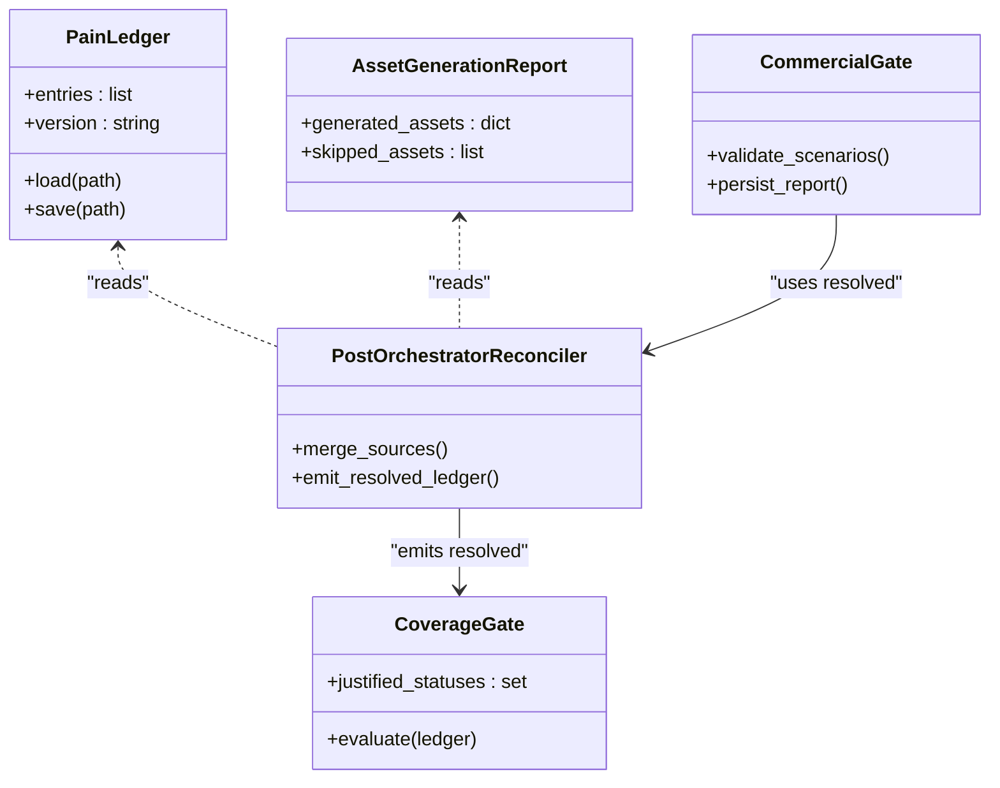
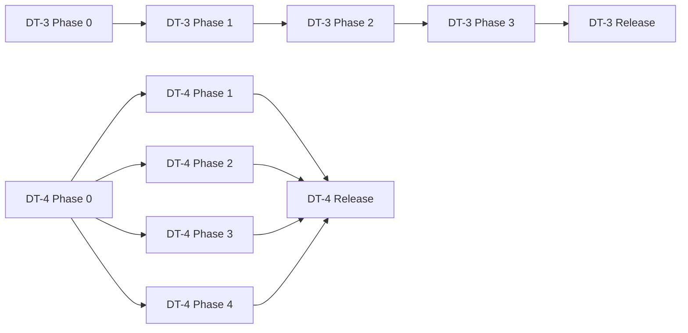

# Technical Debt Resolution (DT-3 & DT-4)

<cite>
**Referenced Files in This Document**
- [01-plan-maestro.md](file://plans/Archives/DT-3-TECH-DEBT-2026-07-25/01-plan-maestro.md)
- [pain_ledger.json](file://plans/Archives/DT-3-TECH-DEBT-2026-07-25/evidence/pain_ledger.json)
- [coherence_validation.json](file://plans/Archives/DT-3-TECH-DEBT-2026-07-25/evidence/coherence_validation.json)
- [delivery_quality_report.json](file://plans/Archives/DT-3-TECH-DEBT-2026-07-25/evidence/delivery_quality_report.json)
- [01-plan-maestro.md](file://plans/Archives/DT-4-ROOT-CAUSE-2026-07-25/01-plan-maestro.md)
- [commercial_gates_report.json](file://plans/Archives/DT-4-ROOT-CAUSE-2026-07-25/evidence/commercial_gates_report.json)
- [BLOCKED_BY_GATES.md](file://plans/Archives/DT-4-ROOT-CAUSE-2026-07-25/evidence/BLOCKED_BY_GATES.md)
- [pain_ledger_resolved.json](file://plans/Archives/DT-4-ROOT-CAUSE-2026-07-25/evidence/pain_ledger_resolved.json)
- [gate_report_20260727_140459.json](file://plans/Archives/DT-4-ROOT-CAUSE-2026-07-25/evidence/gate_report_20260727_140459.json)
- [CONTEXT-DT-3-POST-ANALYSIS-VALIDATED-2026-07-25.md](file://context/Historico/CONTEXT-DT-3-POST-ANALYSIS-VALIDATED-2026-07-25.md)
- [CONTEXT-DT-4.md](file://context/Historico/CONTEXT-DT-4.md)
</cite>

## Table of Contents
1. Introduction
2. Project Structure
3. Core Components
4. Architecture Overview
5. Detailed Component Analysis
6. Dependency Analysis
7. Performance Considerations
8. Troubleshooting Guide
9. Conclusion
10. Appendices

## Introduction
This document formalizes the Technical Debt Resolution methodology for DT-3 and DT-4, focusing on root cause analysis, evidence-based debugging, and a multi-phase approach from diagnosis through resolution and validation. It explains how to maintain a pain ledger, validate coherence, report commercial gates, reconcile orchestrator outputs with actual system behavior, and continuously monitor quality improvements while preserving stability and business continuity.

## Project Structure
The repository organizes technical debt resolutions as structured plans with evidence artifacts:
- Plans define phases, tasks, success criteria, and execution order.
- Evidence directories capture runtime artifacts (gates, ledgers, reports).
- Context documents provide validated post-execution analysis and cross-cutting root causes.

**Diagram sources**
- [01-plan-maestro.md](file://plans/Archives/DT-3-TECH-DEBT-2026-07-25/01-plan-maestro.md)
- [01-plan-maestro.md](file://plans/Archives/DT-4-ROOT-CAUSE-2026-07-25/01-plan-maestro.md)
- [pain_ledger.json](file://plans/Archives/DT-3-TECH-DEBT-2026-07-25/evidence/pain_ledger.json)
- [coherence_validation.json](file://plans/Archives/DT-3-TECH-DEBT-2026-07-25/evidence/coherence_validation.json)
- [delivery_quality_report.json](file://plans/Archives/DT-3-TECH-DEBT-2026-07-25/evidence/delivery_quality_report.json)
- [commercial_gates_report.json](file://plans/Archives/DT-4-ROOT-CAUSE-2026-07-25/evidence/commercial_gates_report.json)
- [BLOCKED_BY_GATES.md](file://plans/Archives/DT-4-ROOT-CAUSE-2026-07-25/evidence/BLOCKED_BY_GATES.md)
- [pain_ledger_resolved.json](file://plans/Archives/DT-4-ROOT-CAUSE-2026-07-25/evidence/pain_ledger_resolved.json)
- [gate_report_20260727_140459.json](file://plans/Archives/DT-4-ROOT-CAUSE-2026-07-25/evidence/gate_report_20260727_140459.json)
- [CONTEXT-DT-3-POST-ANALYSIS-VALIDATED-2026-07-25.md](file://context/Historico/CONTEXT-DT-3-POST-ANALYSIS-VALIDATED-2026-07-25.md)
- [CONTEXT-DT-4.md](file://context/Historico/CONTEXT-DT-4.md)

**Section sources**
- [01-plan-maestro.md](file://plans/Archives/DT-3-TECH-DEBT-2026-07-25/01-plan-maestro.md)
- [01-plan-maestro.md](file://plans/Archives/DT-4-ROOT-CAUSE-2026-07-25/01-plan-maestro.md)
- [CONTEXT-DT-3-POST-ANALYSIS-VALIDATED-2026-07-25.md](file://context/Historico/CONTEXT-DT-3-POST-ANALYSIS-VALIDATED-2026-07-25.md)
- [CONTEXT-DT-4.md](file://context/Historico/CONTEXT-DT-4.md)

## Core Components
- Pain Ledger: Centralized record of detected pains, their status, severity, confidence, and mapping to assets/services.
- Coherence Validation: Scores and checks ensuring consistency between diagnostics, proposals, and assets.
- Delivery Quality Gates: Gate evaluations covering coverage, alignment, asset specificity, and evidence availability.
- Commercial Gates: Business viability checks including ROI, scenario ordering, and narrative clarity.
- Post-Orchestrator Reconciler: Consolidates multiple truth sources into a single resolved state for pains.

Key responsibilities:
- Maintain accurate pain status transitions (DETECTED → DIAGNOSED → MAPPED_TO_SERVICE → ASSET_GENERATED/JUSTIFIED_SKIP/BLOCKED).
- Ensure gate evaluations use consistent contracts and data sources.
- Persist commercial gate outcomes and blockage reasons transparently.
- Reconcile discrepancies across modules after asset orchestration.

**Section sources**
- [pain_ledger.json](file://plans/Archives/DT-3-TECH-DEBT-2026-07-25/evidence/pain_ledger.json)
- [coherence_validation.json](file://plans/Archives/DT-3-TECH-DEBT-2026-07-25/evidence/coherence_validation.json)
- [delivery_quality_report.json](file://plans/Archives/DT-3-TECH-DEBT-2026-07-25/evidence/delivery_quality_report.json)
- [commercial_gates_report.json](file://plans/Archives/DT-4-ROOT-CAUSE-2026-07-25/evidence/commercial_gates_report.json)
- [pain_ledger_resolved.json](file://plans/Archives/DT-4-ROOT-CAUSE-2026-07-25/evidence/pain_ledger_resolved.json)

## Architecture Overview
The DT-3 and DT-4 methodologies operate over a pipeline that detects pains, generates or skips assets, evaluates publication and delivery quality gates, and enforces commercial gates before producing deliverables. A post-orchestrator reconciler consolidates disparate sources into a unified pain state to eliminate false positives and contradictions.

**Diagram sources**
- [01-plan-maestro.md](file://plans/Archives/DT-4-ROOT-CAUSE-2026-07-25/01-plan-maestro.md)
- [pain_ledger_resolved.json](file://plans/Archives/DT-4-ROOT-CAUSE-2026-07-25/evidence/pain_ledger_resolved.json)
- [commercial_gates_report.json](file://plans/Archives/DT-4-ROOT-CAUSE-2026-07-25/evidence/commercial_gates_report.json)
- [BLOCKED_BY_GATES.md](file://plans/Archives/DT-4-ROOT-CAUSE-2026-07-25/evidence/BLOCKED_BY_GATES.md)

**Section sources**
- [01-plan-maestro.md](file://plans/Archives/DT-4-ROOT-CAUSE-2026-07-25/01-plan-maestro.md)
- [CONTEXT-DT-4.md](file://context/Historico/CONTEXT-DT-4.md)

## Detailed Component Analysis

### DT-3 Methodology
DT-3 focuses on resolving systemic path issues, aligning G9 evaluation semantics, and unifying asset alignment models. The plan defines phased interventions with clear success criteria and risk mitigations.

Key elements:
- Fix flat-to-per-hotel paths to ensure correct loading of pain_ledger and coherence files.
- Correct G9 dual-list inconsistency and switch to status-based evaluation.
- Unify ProposalAssetMatrix and AlignmentReport into a canonical contract.

**Diagram sources**
- [01-plan-maestro.md](file://plans/Archives/DT-3-TECH-DEBT-2026-07-25/01-plan-maestro.md)

**Section sources**
- [01-plan-maestro.md](file://plans/Archives/DT-3-TECH-DEBT-2026-07-25/01-plan-maestro.md)
- [delivery_quality_report.json](file://plans/Archives/DT-3-TECH-DEBT-2026-07-25/evidence/delivery_quality_report.json)

### DT-4 Methodology
DT-4 introduces a post-orchestrator reconciler to consolidate three truth sources, resolve false positives, and persist commercial gate outcomes. It prioritizes cross-cutting fixes that address multiple bugs simultaneously.

Key elements:
- Create reconciler to emit pain_ledger_resolved.json with final statuses.
- Update justified statuses to include ASSET_GENERATED.
- Persist commercial gates and enhance blockage documentation.
- Reinterpret optimistic financial scenarios without altering math.

**Diagram sources**
- [pain_ledger.json](file://plans/Archives/DT-3-TECH-DEBT-2026-07-25/evidence/pain_ledger.json)
- [pain_ledger_resolved.json](file://plans/Archives/DT-4-ROOT-CAUSE-2026-07-25/evidence/pain_ledger_resolved.json)
- [commercial_gates_report.json](file://plans/Archives/DT-4-ROOT-CAUSE-2026-07-25/evidence/commercial_gates_report.json)

**Section sources**
- [01-plan-maestro.md](file://plans/Archives/DT-4-ROOT-CAUSE-2026-07-25/01-plan-maestro.md)
- [CONTEXT-DT-4.md](file://context/Historico/CONTEXT-DT-4.md)

### Root Cause Analysis Framework
The framework identifies cross-cutting causes by mapping symptoms to underlying data flow gaps:
- Three independent systems evaluate pain resolution without coordination.
- Missing reconciliation leads to false positives in coverage and divergence in alignment.
- Commercial gates are invisible unless explicitly persisted.

Resolution strategy:
- Implement reconciler to unify states.
- Standardize justified statuses.
- Enhance reporting for commercial gates.

**Section sources**
- [CONTEXT-DT-3-POST-ANALYSIS-VALIDATED-2026-07-25.md](file://context/Historico/CONTEXT-DT-3-POST-ANALYSIS-VALIDATED-2026-07-25.md)
- [CONTEXT-DT-4.md](file://context/Historico/CONTEXT-DT-4.md)

## Dependency Analysis
DT-3 and DT-4 phases have explicit dependencies:
- DT-3 Phase 0 must precede Phase 2 to ensure data correctness.
- DT-4 Phase 0 (reconciler) enables subsequent fixes for coverage, alignment, and commercial visibility.

**Diagram sources**
- [01-plan-maestro.md](file://plans/Archives/DT-3-TECH-DEBT-2026-07-25/01-plan-maestro.md)
- [01-plan-maestro.md](file://plans/Archives/DT-4-ROOT-CAUSE-2026-07-25/01-plan-maestro.md)

**Section sources**
- [01-plan-maestro.md](file://plans/Archives/DT-3-TECH-DEBT-2026-07-25/01-plan-maestro.md)
- [01-plan-maestro.md](file://plans/Archives/DT-4-ROOT-CAUSE-2026-07-25/01-plan-maestro.md)

## Performance Considerations
- Minimize redundant reads by centralizing pain state via reconciler.
- Use targeted edits for low-risk phases to reduce integration overhead.
- Validate with real-world runs (v4complete) to catch runtime discrepancies early.
- Monitor gate performance to avoid blocking legitimate deliveries due to false positives.

[No sources needed since this section provides general guidance]

## Troubleshooting Guide
Common issues and resolutions:
- Coverage false positives: Ensure skipped assets propagate to pain_ledger with appropriate status.
- Commercial gates invisibility: Persist commercial_gates_report.json and update blockage documentation.
- Divergent alignment counts: Use unified contract and enriched JSON fields for consistent evaluation.
- Coherence score inconsistencies: Integrate site presence data into coherence checks.

**Section sources**
- [BLOCKED_BY_GATES.md](file://plans/Archives/DT-4-ROOT-CAUSE-2026-07-25/evidence/BLOCKED_BY_GATES.md)
- [gate_report_20260727_140459.json](file://plans/Archives/DT-4-ROOT-CAUSE-2026-07-25/evidence/gate_report_20260727_140459.json)
- [coherence_validation.json](file://plans/Archives/DT-3-TECH-DEBT-2026-07-25/evidence/coherence_validation.json)

## Conclusion
The DT-3 and DT-4 methodologies provide a systematic approach to technical debt resolution through root cause analysis, evidence-based debugging, and phased implementation. By consolidating data sources, standardizing evaluations, and enhancing transparency, the system achieves higher reliability and business-aligned outcomes while maintaining stability and continuity.

[No sources needed since this section summarizes without analyzing specific files]

## Appendices
- Evidence artifacts: pain_ledger.json, coherence_validation.json, delivery_quality_report.json, commercial_gates_report.json, BLOCKED_BY_GATES.md, pain_ledger_resolved.json, gate_report_*.json.
- Plan documents: DT-3 and DT-4 master plans with phase definitions, success criteria, and execution orders.
- Context documents: Validated analyses detailing root causes, corrections, and recommendations.

**Section sources**
- [pain_ledger.json](file://plans/Archives/DT-3-TECH-DEBT-2026-07-25/evidence/pain_ledger.json)
- [coherence_validation.json](file://plans/Archives/DT-3-TECH-DEBT-2026-07-25/evidence/coherence_validation.json)
- [delivery_quality_report.json](file://plans/Archives/DT-3-TECH-DEBT-2026-07-25/evidence/delivery_quality_report.json)
- [commercial_gates_report.json](file://plans/Archives/DT-4-ROOT-CAUSE-2026-07-25/evidence/commercial_gates_report.json)
- [BLOCKED_BY_GATES.md](file://plans/Archives/DT-4-ROOT-CAUSE-2026-07-25/evidence/BLOCKED_BY_GATES.md)
- [pain_ledger_resolved.json](file://plans/Archives/DT-4-ROOT-CAUSE-2026-07-25/evidence/pain_ledger_resolved.json)
- [gate_report_20260727_140459.json](file://plans/Archives/DT-4-ROOT-CAUSE-2026-07-25/evidence/gate_report_20260727_140459.json)
- [01-plan-maestro.md](file://plans/Archives/DT-3-TECH-DEBT-2026-07-25/01-plan-maestro.md)
- [01-plan-maestro.md](file://plans/Archives/DT-4-ROOT-CAUSE-2026-07-25/01-plan-maestro.md)
- [CONTEXT-DT-3-POST-ANALYSIS-VALIDATED-2026-07-25.md](file://context/Historico/CONTEXT-DT-3-POST-ANALYSIS-VALIDATED-2026-07-25.md)
- [CONTEXT-DT-4.md](file://context/Historico/CONTEXT-DT-4.md)