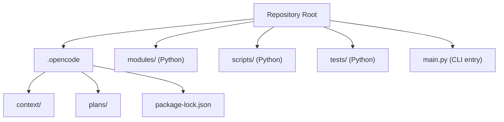
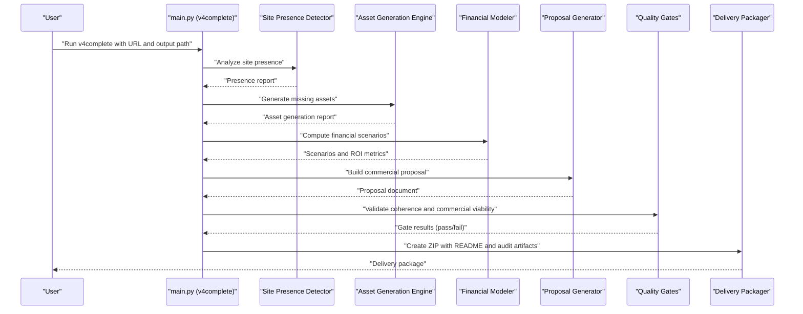
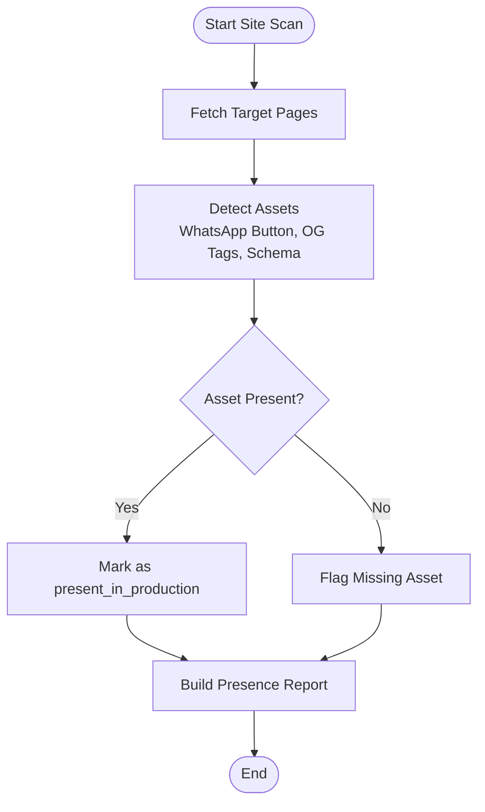
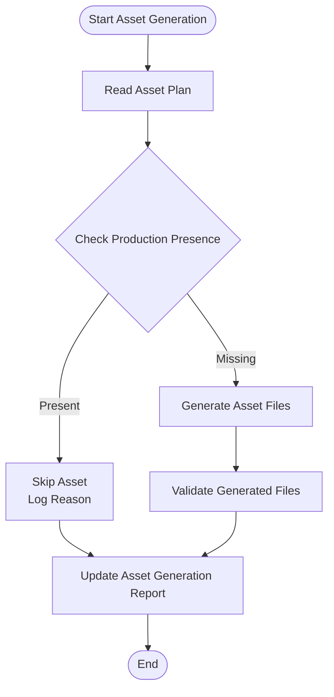
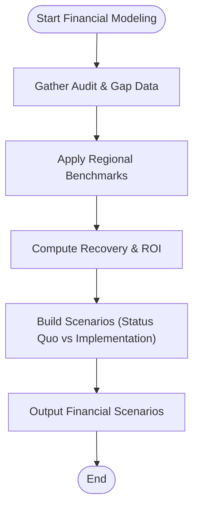
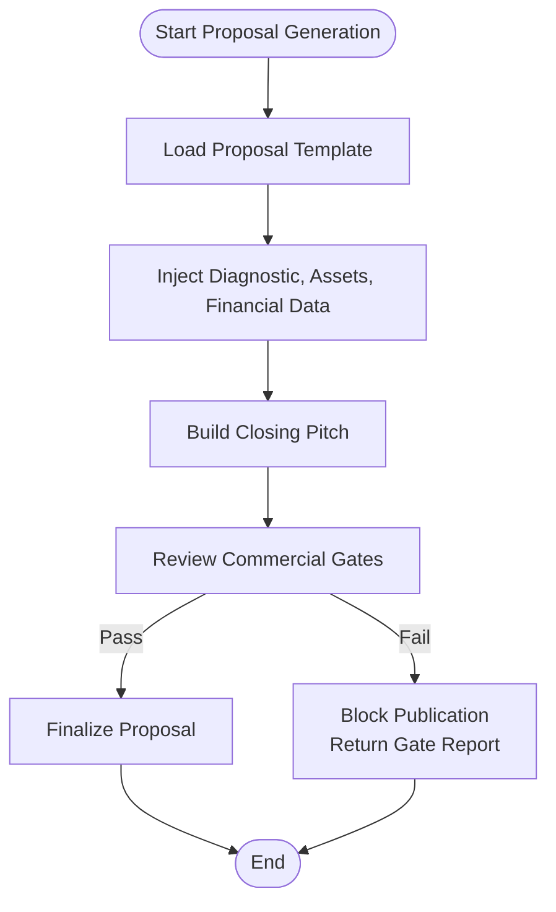
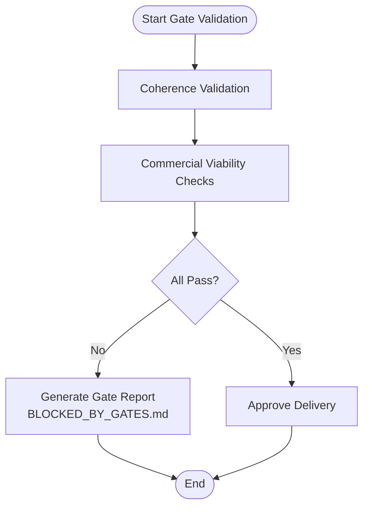
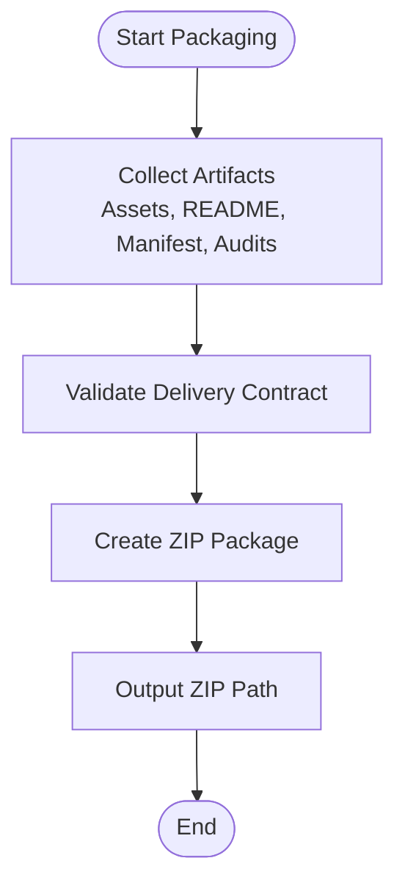
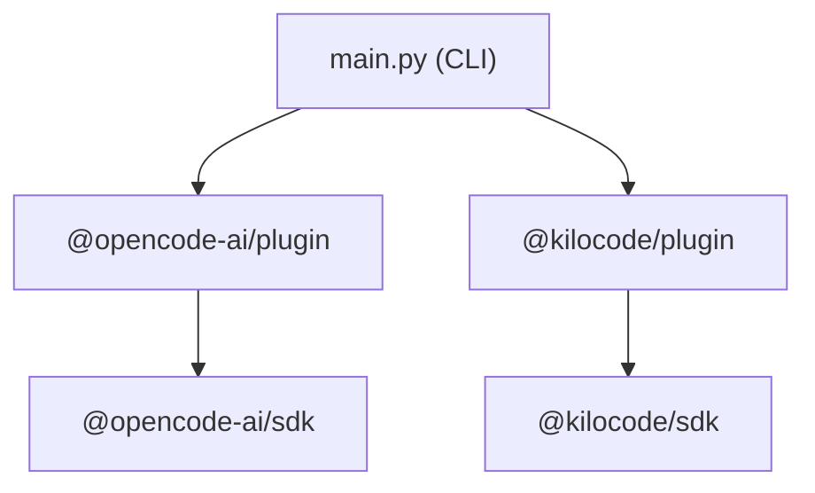

# Project Overview and Introduction

<cite>
**Referenced Files in This Document**
- [package-lock.json](file://package-lock.json)
- [DT-1-README-DELIVERY-PRESENT-IN-PRODUCTION.md](file://context\Historico\DT-1-README-DELIVERY-PRESENT-IN-PRODUCTION.md)
- [roadmap-enrichlabs-vertical-hotels-strategy.md](file://context\Historico\roadmap-enrichlabs-vertical-hotels-strategy.md)
- [CONTEXT-EVIDENCE-TIER-FALSE-CONFIDENCE-IAO-2026-07-30.md](file://context\CONTEXT-EVIDENCE-TIER-FALSE-CONFIDENCE-IAO-2026-07-30.md)
- [BLOCKED_BY_GATES.md](file://plans\Archives\EVIDENCE-TIER-FALSE-CONFIDENCE-IAO-2026-07-31\evidence\FASE-5\control-sin-onboarding\BLOCKED_BY_GATES.md)
- [05-prompt-inicio-sesion-fase-6.md](file://plans\Archives\DT4-RESIDUAL-FIXES\05-prompt-inicio-sesion-fase-6.md)
- [01-plan-maestro.md](file://plans\Archives\DT-2-DELIVERY-CONTRACT-RESIDUAL-2026-07-24\01-plan-maestro.md)
</cite>

## Table of Contents
1. [Introduction](#introduction)
2. [Project Structure](#project-structure)
3. [Core Components](#core-components)
4. [Architecture Overview](#architecture-overview)
5. [Detailed Component Analysis](#detailed-component-analysis)
6. [Dependency Analysis](#dependency-analysis)
7. [Performance Considerations](#performance-considerations)
8. [Troubleshooting Guide](#troubleshooting-guide)
9. [Conclusion](#conclusion)

## Introduction
The iah-cli project is an enterprise-grade command-line tool that powers AI-driven hotel business intelligence and commercial proposal generation. It automates the end-to-end workflow from website analysis to asset creation, financial modeling, and delivery packaging—ensuring that every output is evidence-backed and quality-gated before reaching the client.

Purpose:
- Automate site presence detection across digital assets (e.g., WhatsApp button, Open Graph tags, schema markup).
- Generate technical assets and implementation-ready files for hotels’ websites.
- Build financial scenarios and ROI-based commercial proposals grounded in audit findings.
- Enforce multi-layered quality gates and produce a consistent delivery package (ZIP + README + manifests).

Core objectives:
- Evidence-based development practices: every claim in the proposal is backed by audit data, asset reports, and gate results.
- Multi-layered quality assurance: publication gates, commercial gates, coherence validation, and delivery contract checks.
- Automated delivery packaging: deterministic ZIP artifacts with synchronized README, manifest, and audit trails.

Target audience:
- Hotel business analysts who need fast, reliable insights and actionable proposals.
- Sales teams who require professional, data-backed commercial documents aligned with client realities.
- Developers integrating or extending the plugin architecture and pipeline components.

Installation prerequisites:
- Node.js environment to install CLI plugins used by the orchestration layer.
- Required dependencies: @opencode-ai/plugin and @kilocode/plugin.

Basic usage example:
- Run the full v4complete pipeline against a hotel website using the main entry point:
  - Command pattern: python main.py v4complete --url <hotel_url> [--output <output_dir>]
  - Example: python main.py v4complete --url https://zione.co/ --output output/clientes

Conceptual overview for beginners:
- The tool scans a hotel’s website to detect missing or misconfigured digital assets (site presence detection).
- It generates the necessary code snippets and documentation (asset generation engine).
- It models financial impact based on recovery potential and operational costs (financial modeling).
- It produces a commercial proposal and a delivery package validated by quality gates (delivery packaging).

Technical overview for developers:
- The CLI orchestrates modules that implement site presence detection, asset generation, financial scenario calculation, and proposal templating.
- Plugin architecture integrates external capabilities via @opencode-ai/plugin and @kilocode/plugin.
- Quality gates enforce consistency between diagnosis, proposal, assets, and delivery artifacts.

Practical use cases:
- New hotel onboarding: run v4complete to generate diagnostic, proposal, assets, and delivery package for a new property.
- Existing client updates: re-run v4complete after changes to validate improvements and refresh the proposal.
- Quality audits: inspect gate reports, asset generation reports, and coherence validations to ensure compliance.

**Section sources**
- [package-lock.json:1-181](file://package-lock.json#L1-L181)
- [roadmap-enrichlabs-vertical-hotels-strategy.md:67-85](file://context\Historico\roadmap-enrichlabs-vertical-hotels-strategy.md#L67-L85)
- [05-prompt-inicio-sesion-fase-6.md:34-66](file://plans\Archives\DT4-RESIDUAL-FIXES\05-prompt-inicio-sesion-fase-6.md#L34-L66)
- [01-plan-maestro.md:167-183](file://plans\Archives\DT-2-DELIVERY-CONTRACT-RESIDUAL-2026-07-24\01-plan-maestro.md#L167-L183)

## Project Structure
At a high level, the repository organizes plans, context, and configuration artifacts under .opencode, while the executable CLI and modules live at the repository root. Key areas include:
- Context: historical analyses, bug investigations, and strategy notes that inform pipeline behavior and quality gates.
- Plans: phased execution plans, prompts, checklists, and post-implementation analyses for feature releases and fixes.
- Package lock: dependency definitions for Node.js plugins used by the orchestration layer.

[No sources needed since this diagram shows conceptual structure, not specific code mappings]

**Section sources**
- [package-lock.json:1-181](file://package-lock.json#L1-L181)

## Core Components
- Site Presence Detection: Scans target URLs to verify presence and correctness of key assets (e.g., WhatsApp button, Open Graph tags, schema markup). Outputs structured reports used downstream.
- Asset Generation Engine: Produces ready-to-deploy assets and instructions when assets are missing or incomplete; respects production presence to avoid redundant outputs.
- Financial Modeling: Calculates recovery potential, ROI, payback periods, and monthly impacts to ground proposals in quantifiable metrics.
- Commercial Proposal Generator: Builds narrative and financial sections tailored to the hotel, aligning diagnosis with proposed actions and expected outcomes.
- Quality Gates: Publication gates ensure deliverables meet standards; commercial gates validate viability and clarity of the proposal before release.
- Delivery Packaging: Generates a ZIP artifact with synchronized README, manifest, and audit reports, ensuring consistency across all artifacts.

Evidence-based practices:
- All claims in proposals are tied to audit findings and asset reports.
- Gate reports and coherence validations provide verifiable proof of quality and alignment.

Multi-layered quality assurance:
- Coherence validation ensures diagnosis, proposal, and assets tell the same story.
- Delivery contract checks guarantee that the ZIP contents match the README and manifest exactly.

Automated delivery packaging:
- Deterministic ZIP generation with embedded README and audit artifacts.
- Skipped assets are documented with reasons (e.g., present_in_production), preventing false expectations.

**Section sources**
- [DT-1-README-DELIVERY-PRESENT-IN-PRODUCTION.md:144-203](file://context\Historico\DT-1-README-DELIVERY-PRESENT-IN-PRODUCTION.md#L144-L203)
- [roadmap-enrichlabs-vertical-hotels-strategy.md:67-85](file://context\Historico\roadmap-enrichlabs-vertical-hotels-strategy.md#L67-L85)

## Architecture Overview
The iah-cli pipeline orchestrates multiple modules through a central CLI entry point. Data flows from site scanning into asset generation, financial modeling, proposal construction, and finally delivery packaging, with quality gates enforcing consistency at each stage.

[No sources needed since this diagram shows conceptual workflow, not actual code structure]

## Detailed Component Analysis

### Site Presence Detection
- Purpose: Identify whether critical digital assets exist and are correctly configured on the hotel’s website.
- Output: Structured presence report used by asset generation and quality gates.
- Behavior: Respects production presence to skip unnecessary asset generation.

[No sources needed since this diagram shows conceptual workflow, not actual code structure]

**Section sources**
- [DT-1-README-DELIVERY-PRESENT-IN-PRODUCTION.md:144-203](file://context\Historico\DT-1-README-DELIVERY-PRESENT-IN-PRODUCTION.md#L144-L203)

### Asset Generation Engine
- Purpose: Produce deployment-ready assets when site presence detection indicates gaps.
- Behavior: Skips assets already present in production; documents reasons for skipping.
- Integration: Feeds asset plan into proposal generator and quality gates.

[No sources needed since this diagram shows conceptual workflow, not actual code structure]

**Section sources**
- [DT-1-README-DELIVERY-PRESENT-IN-PRODUCTION.md:144-203](file://context\Historico\DT-1-README-DELIVERY-PRESENT-IN-PRODUCTION.md#L144-L203)

### Financial Modeling
- Purpose: Quantify recovery potential, ROI, and payback periods based on audit findings and market benchmarks.
- Inputs: Audit results, asset gaps, regional benchmarks, optional analytics integration.
- Outputs: Financial scenarios used to build persuasive, data-backed proposals.

[No sources needed since this diagram shows conceptual workflow, not actual code structure]

**Section sources**
- [roadmap-enrichlabs-vertical-hotels-strategy.md:67-85](file://context\Historico\roadmap-enrichlabs-vertical-hotels-strategy.md#L67-L85)

### Commercial Proposal Generator
- Purpose: Create a cohesive commercial proposal aligned with diagnosis, assets, and financial scenarios.
- Features: Dynamic closing pitch, status quo comparison tables, and clear CTAs informed by onboarding state.
- Constraints: Avoids technical jargon in management-facing views; ensures commercial viability via gates.

[No sources needed since this diagram shows conceptual workflow, not actual code structure]

**Section sources**
- [roadmap-enrichlabs-vertical-hotels-strategy.md:67-85](file://context\Historico\roadmap-enrichlabs-vertical-hotels-strategy.md#L67-L85)

### Quality Gates
- Purpose: Ensure coherence between diagnosis, proposal, assets, and delivery artifacts; enforce commercial viability.
- Types: Publication gates (technical quality), commercial gates (viability and clarity).
- Outputs: Gate reports and BLOCKED_BY_GATES.md when failures occur.

[No sources needed since this diagram shows conceptual workflow, not actual code structure]

**Section sources**
- [BLOCKED_BY_GATES.md:1-37](file://plans\Archives\EVIDENCE-TIER-FALSE-CONFIDENCE-IAO-2026-07-31\evidence\FASE-5\control-sin-onboarding\BLOCKED_BY_GATES.md#L1-L37)

### Delivery Packaging
- Purpose: Assemble a deterministic ZIP containing assets, README, manifest, and audit artifacts.
- Consistency: README dynamically reflects actual ZIP contents; manifest synchronizes with generated files.
- Evidence: Includes audit reports and gate results for traceability.

[No sources needed since this diagram shows conceptual workflow, not actual code structure]

**Section sources**
- [DT-1-README-DELIVERY-PRESENT-IN-PRODUCTION.md:144-203](file://context\Historico\DT-1-README-DELIVERY-PRESENT-IN-PRODUCTION.md#L144-L203)

## Dependency Analysis
The CLI relies on Node.js plugins for orchestration and SDK capabilities. Dependencies are defined in the package lock file, specifying versions and integrity hashes for reproducibility.

**Diagram sources**
- [package-lock.json:1-181](file://package-lock.json#L1-L181)

**Section sources**
- [package-lock.json:1-181](file://package-lock.json#L1-L181)

## Performance Considerations
- Long-running v4complete executions can take several minutes; ensure adequate timeouts and background execution strategies.
- Minimize redundant asset generation by leveraging site presence detection and production-aware skipping.
- Cache intermediate results where possible to reduce repeated computations during iterative runs.

[No sources needed since this section provides general guidance]

## Troubleshooting Guide
Common issues and resolutions:
- Commercial gates blocking proposal generation: Review commercial gate reports and adjust proposal content to remove jargon and ensure positive ROI narratives.
- Publication gates failing due to coverage or coherence: Inspect gate reports and fix missing assets or inconsistencies between diagnosis and proposal.
- Delivery contract mismatches: Verify that README, manifest, and ZIP contents are synchronized; regenerate artifacts if discrepancies are found.

**Section sources**
- [BLOCKED_BY_GATES.md:1-37](file://plans\Archives\EVIDENCE-TIER-FALSE-CONFIDENCE-IAO-2026-07-31\evidence\FASE-5\control-sin-onboarding\BLOCKED_BY_GATES.md#L1-L37)
- [DT-1-README-DELIVERY-PRESENT-IN-PRODUCTION.md:144-203](file://context\Historico\DT-1-README-DELIVERY-PRESENT-IN-PRODUCTION.md#L144-L203)

## Conclusion
The iah-cli project delivers a robust, evidence-backed pipeline for hotel digital transformation. By combining site presence detection, asset generation, financial modeling, and quality-gated delivery packaging, it empowers analysts and sales teams to produce professional commercial proposals efficiently. Its plugin architecture and deterministic outputs make it suitable for both enterprise adoption and developer extension.

[No sources needed since this section summarizes without analyzing specific files]