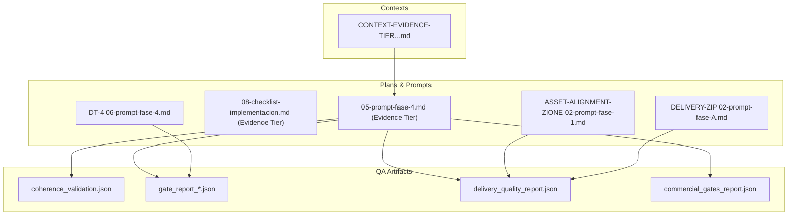
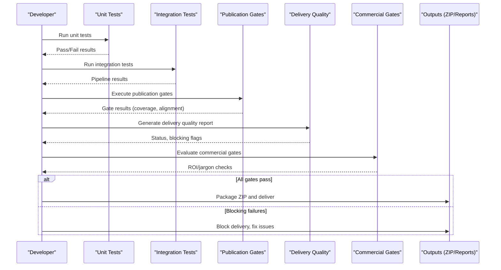
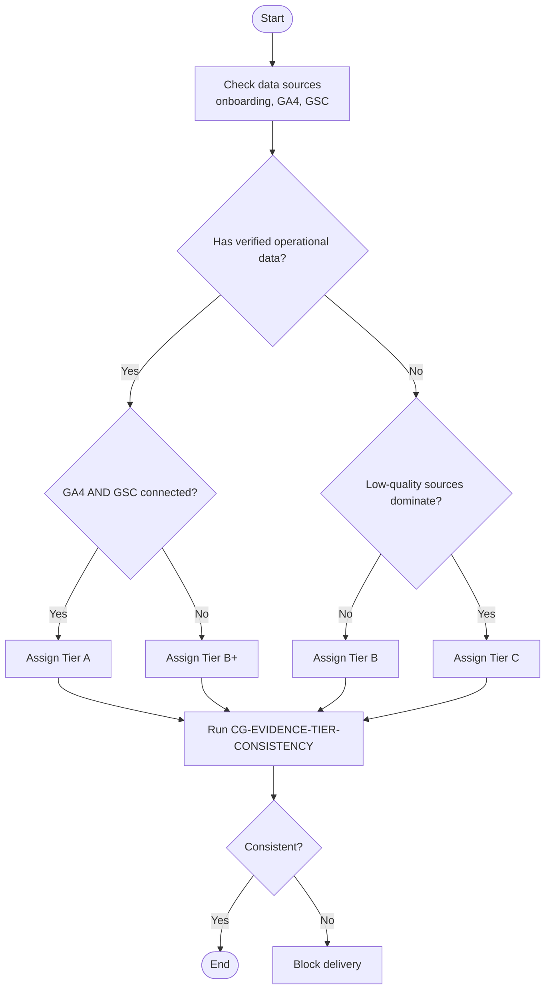
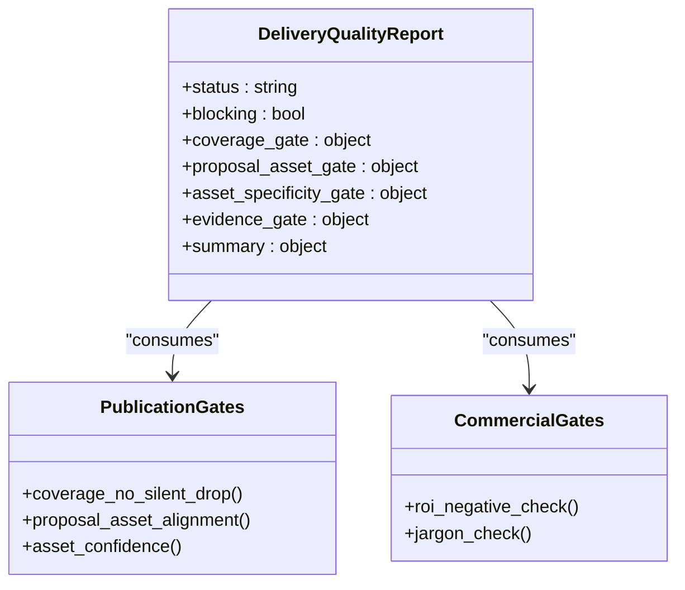
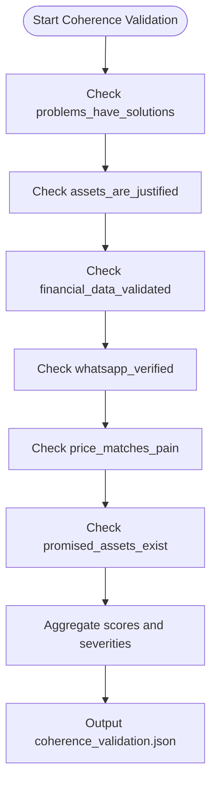
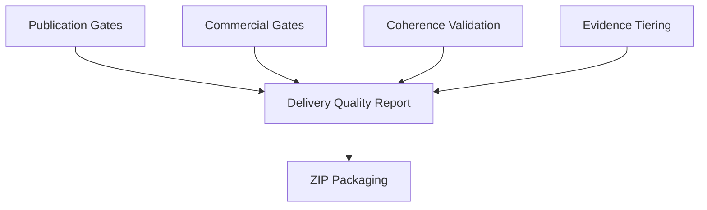

# Testing and Quality Assurance

<cite>
**Referenced Files in This Document**
- [CONTEXT-EVIDENCE-TIER-FALSE-CONFIDENCE-IAO-2026-07-30.md](file://context/CONTEXT-EVIDENCE-TIER-FALSE-CONFIDENCE-IAO-2026-07-30.md)
- [coherence_validation.json](file://plans/Archives/DT-3-TECH-DEBT-2026-07-25/evidence/coherence_validation.json)
- [gate_report_20260727_140459.json](file://plans/Archives/DT-4-ROOT-CAUSE-2026-07-25/evidence/gate_report_20260727_140459.json)
- [delivery_quality_report.json](file://plans/Archives/DT-3-TECH-DEBT-2026-07-25/evidence/delivery_quality_report.json)
- [commercial_gates_report.json](file://plans/Archives/DT-4-ROOT-CAUSE-2026-07-25/evidence/commercial_gates_report.json)
- [05-prompt-fase-4.md (Evidence Tier)](file://plans/Archives/EVIDENCE-TIER-FALSE-CONFIDENCE-IAO-2026-07-31/05-prompt-fase-4.md)
- [08-checklist-implementacion.md (Evidence Tier)](file://plans/Archives/EVIDENCE-TIER-FALSE-CONFIDENCE-IAO-2026-07-31/08-checklist-implementacion.md)
- [ASSET-ALIGNMENT-ZIONE-2026-07-23 02-prompt-fase-1.md](file://plans/Archives/ASSET-ALIGNMENT-ZIONE-2026-07-23/02-prompt-fase-1.md)
- [DT-4-ROOT-CAUSE-2026-07-25 06-prompt-fase-4.md](file://plans/Archives/DT-4-ROOT-CAUSE-2026-07-25/06-prompt-fase-4.md)
- [DELIVERY-ZIP-SINGLE-WRITE-2026-08-01 02-prompt-fase-A.md](file://plans/DELIVERY-ZIP-SINGLE-WRITE-2026-08-01/02-prompt-fase-A.md)
</cite>

## Table of Contents
1. Introduction
2. Project Structure
3. Core Components
4. Architecture Overview
5. Detailed Component Analysis
6. Dependency Analysis
7. Performance Considerations
8. Troubleshooting Guide
9. Conclusion
10. Appendices

## Introduction
This document explains the testing and quality assurance framework used by iah-cli, focusing on a multi-layered validation approach that includes unit tests, integration tests, and evidence-based debugging. It documents the quality gates system (coherence validation, alignment checking, publication readiness), the evidence collection methodology for capturing test results, error logs, and validation outputs, and how to interpret gate reports with pass/fail criteria and warning thresholds. Practical examples are provided for writing tests around asset generation, financial calculations, and document rendering. The checklist-based implementation approach is covered through preflight checks, post-validation procedures, and regression strategies. Finally, performance testing considerations, load testing guidance for large hotel datasets, and production monitoring practices are included.

## Project Structure
The repository’s QA artifacts and plans are organized under:
- context/: Deep-dive diagnostics and bug contexts that inform test design and gate improvements.
- plans/Archives/: Historical plans and evidence artifacts (JSON reports, checklists, prompts) that define gate contracts, test suites, and delivery validations.

Key directories and files relevant to QA:
- Evidence JSONs: coherence_validation.json, gate_report_*.json, delivery_quality_report.json, commercial_gates_report.json
- Plan prompts and checklists: multiple 05-prompt-fase-*.md and 08-checklist-implementacion.md files that specify test structures, acceptance criteria, and execution commands.

**Diagram sources**
- [coherence_validation.json](file://plans/Archives/DT-3-TECH-DEBT-2026-07-25/evidence/coherence_validation.json)
- [gate_report_20260727_140459.json](file://plans/Archives/DT-4-ROOT-CAUSE-2026-07-25/evidence/gate_report_20260727_140459.json)
- [delivery_quality_report.json](file://plans/Archives/DT-3-TECH-DEBT-2026-07-25/evidence/delivery_quality_report.json)
- [commercial_gates_report.json](file://plans/Archives/DT-4-ROOT-CAUSE-2026-07-25/evidence/commercial_gates_report.json)
- [05-prompt-fase-4.md (Evidence Tier)](file://plans/Archives/EVIDENCE-TIER-FALSE-CONFIDENCE-IAO-2026-07-31/05-prompt-fase-4.md)
- [08-checklist-implementacion.md (Evidence Tier)](file://plans/Archives/EVIDENCE-TIER-FALSE-CONFIDENCE-IAO-2026-07-31/08-checklist-implementacion.md)
- [ASSET-ALIGNMENT-ZIONE-2026-07-23 02-prompt-fase-1.md](file://plans/Archives/ASSET-ALIGNMENT-ZIONE-2026-07-23/02-prompt-fase-1.md)
- [DT-4-ROOT-CAUSE-2026-07-25 06-prompt-fase-4.md](file://plans/Archives/DT-4-ROOT-CAUSE-2026-07-25/06-prompt-fase-4.md)
- [DELIVERY-ZIP-SINGLE-WRITE-2026-08-01 02-prompt-fase-A.md](file://plans/DELIVERY-ZIP-SINGLE-WRITE-2026-08-01/02-prompt-fase-A.md)

**Section sources**
- [CONTEXT-EVIDENCE-TIER-FALSE-CONFIDENCE-IAO-2026-07-30.md](file://context/CONTEXT-EVIDENCE-TIER-FALSE-CONFIDENCE-IAO-2026-07-30.md)
- [coherence_validation.json](file://plans/Archives/DT-3-TECH-DEBT-2026-07-25/evidence/coherence_validation.json)
- [gate_report_20260727_140459.json](file://plans/Archives/DT-4-ROOT-CAUSE-2026-07-25/evidence/gate_report_20260727_140459.json)
- [delivery_quality_report.json](file://plans/Archives/DT-3-TECH-DEBT-2026-07-25/evidence/delivery_quality_report.json)
- [commercial_gates_report.json](file://plans/Archives/DT-4-ROOT-CAUSE-2026-07-25/evidence/commercial_gates_report.json)

## Core Components
- Coherence Validation: Produces structured checks with scores, severities, errors, and warnings to ensure internal consistency across generated content.
- Publication Gates: A set of gates (e.g., coverage_no_silent_drop, proposal_asset_alignment) that enforce quality before publishing or delivering assets.
- Delivery Quality Report: Aggregates gate outcomes into a single report with status, blocking flags, and summaries to decide packaging and delivery.
- Commercial Gates: Business-oriented checks (e.g., ROI negativity, jargon usage) that influence go/no-go decisions.
- Evidence Tiering: A tier model (A/B+/B/C) that reflects data provenance and verification levels, now including a new B+ tier for verified operational data without GA4/GSC.

These components interact to form a robust pipeline where unit tests validate logic, integration tests verify end-to-end flows, and gate reports provide actionable feedback.

**Section sources**
- [coherence_validation.json](file://plans/Archives/DT-3-TECH-DEBT-2026-07-25/evidence/coherence_validation.json)
- [gate_report_20260727_140459.json](file://plans/Archives/DT-4-ROOT-CAUSE-2026-07-25/evidence/gate_report_20260727_140459.json)
- [delivery_quality_report.json](file://plans/Archives/DT-3-TECH-DEBT-2026-07-25/evidence/delivery_quality_report.json)
- [commercial_gates_report.json](file://plans/Archives/DT-4-ROOT-CAUSE-2026-07-25/evidence/commercial_gates_report.json)
- [CONTEXT-EVIDENCE-TIER-FALSE-CONFIDENCE-IAO-2026-07-30.md](file://context/CONTEXT-EVIDENCE-TIER-FALSE-CONFIDENCE-IAO-2026-07-30.md)

## Architecture Overview
The QA architecture integrates multiple layers:
- Unit Tests: Validate core functions like evidence tier determination and gate logic.
- Integration Tests: Exercise full pipelines (e.g., v4complete with onboarding YAML).
- Gate Reports: Capture per-gate results, readiness status, and suggestions.
- Delivery Packaging: Uses delivery quality reports to decide whether to package and deliver.

[No sources needed since this diagram shows conceptual workflow, not actual code structure]

## Detailed Component Analysis

### Evidence Tiering and Consistency Gate
The evidence tier model ensures transparency about data provenance and verification. A new B+ tier captures scenarios with verified operational data but without GA4/GSC. A consistency gate prevents contradictory claims (e.g., asserting Tier A while GA4/GSC are not configured).

**Diagram sources**
- [CONTEXT-EVIDENCE-TIER-FALSE-CONFIDENCE-IAO-2026-07-30.md](file://context/CONTEXT-EVIDENCE-TIER-FALSE-CONFIDENCE-IAO-2026-07-30.md)
- [05-prompt-fase-4.md (Evidence Tier)](file://plans/Archives/EVIDENCE-TIER-FALSE-CONFIDENCE-IAO-2026-07-31/05-prompt-fase-4.md)

**Section sources**
- [CONTEXT-EVIDENCE-TIER-FALSE-CONFIDENCE-IAO-2026-07-30.md](file://context/CONTEXT-EVIDENCE-TIER-FALSE-CONFIDENCE-IAO-2026-07-30.md)
- [05-prompt-fase-4.md (Evidence Tier)](file://plans/Archives/EVIDENCE-TIER-FALSE-CONFIDENCE-IAO-2026-07-31/05-prompt-fase-4.md)
- [08-checklist-implementacion.md (Evidence Tier)](file://plans/Archives/EVIDENCE-TIER-FALSE-CONFIDENCE-IAO-2026-07-31/08-checklist-implementacion.md)

### Asset Alignment and Delivery Quality
Asset alignment ensures promised services have corresponding assets. Delivery quality aggregates gate results and decides packaging.

**Diagram sources**
- [delivery_quality_report.json](file://plans/Archives/DT-3-TECH-DEBT-2026-07-25/evidence/delivery_quality_report.json)
- [gate_report_20260727_140459.json](file://plans/Archives/DT-4-ROOT-CAUSE-2026-07-25/evidence/gate_report_20260727_140459.json)
- [commercial_gates_report.json](file://plans/Archives/DT-4-ROOT-CAUSE-2026-07-25/evidence/commercial_gates_report.json)

**Section sources**
- [ASSET-ALIGNMENT-ZIONE-2026-07-23 02-prompt-fase-1.md](file://plans/Archives/ASSET-ALIGNMENT-ZIONE-2026-07-23/02-prompt-fase-1.md)
- [delivery_quality_report.json](file://plans/Archives/DT-3-TECH-DEBT-2026-07-25/evidence/delivery_quality_report.json)
- [gate_report_20260727_140459.json](file://plans/Archives/DT-4-ROOT-CAUSE-2026-07-25/evidence/gate_report_20260727_140459.json)
- [commercial_gates_report.json](file://plans/Archives/DT-4-ROOT-CAUSE-2026-07-25/evidence/commercial_gates_report.json)

### Coherence Validation Checks
Coherence validation produces structured checks with scores and severities to ensure internal consistency.

**Diagram sources**
- [coherence_validation.json](file://plans/Archives/DT-3-TECH-DEBT-2026-07-25/evidence/coherence_validation.json)

**Section sources**
- [coherence_validation.json](file://plans/Archives/DT-3-TECH-DEBT-2026-07-25/evidence/coherence_validation.json)

## Dependency Analysis
The QA components depend on each other to form a cohesive validation pipeline:
- Publication gates feed into delivery quality reports.
- Commercial gates influence business decisions.
- Coherence validation ensures internal consistency.
- Evidence tiering provides transparency about data provenance.

[No sources needed since this diagram shows conceptual relationships, not direct code mappings]

**Section sources**
- [delivery_quality_report.json](file://plans/Archives/DT-3-TECH-DEBT-2026-07-25/evidence/delivery_quality_report.json)
- [gate_report_20260727_140459.json](file://plans/Archives/DT-4-ROOT-CAUSE-2026-07-25/evidence/gate_report_20260727_140459.json)
- [commercial_gates_report.json](file://plans/Archives/DT-4-ROOT-CAUSE-2026-07-25/evidence/commercial_gates_report.json)
- [coherence_validation.json](file://plans/Archives/DT-3-TECH-DEBT-2026-07-25/evidence/coherence_validation.json)

## Performance Considerations
- Unit tests should be fast and isolated, focusing on core logic like evidence tier determination and gate conditions.
- Integration tests may take longer due to end-to-end pipeline execution; consider parallelization and caching where possible.
- Load testing for large hotel datasets should simulate high-volume scenarios to identify bottlenecks in asset generation and report creation.
- Monitoring production deployments should include metrics on gate failure rates, coherence scores, and delivery success rates.

[No sources needed since this section provides general guidance]

## Troubleshooting Guide
Common quality issues and debugging techniques:
- Evidence tier contradictions: Use the consistency gate to detect and block deliveries with conflicting claims.
- Asset alignment failures: Review publication gate results and update asset generation or proposal alignment logic.
- Coherence validation errors: Investigate specific checks with low scores and adjust content generation or data inputs.
- Commercial gate warnings: Address ROI negativity or jargon usage by refining proposals and communication.

**Section sources**
- [CONTEXT-EVIDENCE-TIER-FALSE-CONFIDENCE-IAO-2026-07-30.md](file://context/CONTEXT-EVIDENCE-TIER-FALSE-CONFIDENCE-IAO-2026-07-30.md)
- [gate_report_20260727_140459.json](file://plans/Archives/DT-4-ROOT-CAUSE-2026-07-25/evidence/gate_report_20260727_140459.json)
- [commercial_gates_report.json](file://plans/Archives/DT-4-ROOT-CAUSE-2026-07-25/evidence/commercial_gates_report.json)

## Conclusion
The iah-cli testing and quality assurance framework combines unit tests, integration tests, and comprehensive gate systems to ensure reliable and transparent outputs. The evidence tiering model enhances trust by clearly stating data provenance, while coherence and alignment checks maintain internal consistency. By following the documented practices and troubleshooting guides, teams can deliver high-quality assets and reports with confidence.

[No sources needed since this section summarizes without analyzing specific files]

## Appendices
- Practical examples of writing tests for asset generation, financial calculations, and document rendering are outlined in the plan prompts and checklists.
- Preflight checks, post-validation procedures, and regression testing strategies are detailed in the referenced files.

**Section sources**
- [05-prompt-fase-4.md (Evidence Tier)](file://plans/Archives/EVIDENCE-TIER-FALSE-CONFIDENCE-IAO-2026-07-31/05-prompt-fase-4.md)
- [08-checklist-implementacion.md (Evidence Tier)](file://plans/Archives/EVIDENCE-TIER-FALSE-CONFIDENCE-IAO-2026-07-31/08-checklist-implementacion.md)
- [DELIVERY-ZIP-SINGLE-WRITE-2026-08-01 02-prompt-fase-A.md](file://plans/DELIVERY-ZIP-SINGLE-WRITE-2026-08-01/02-prompt-fase-A.md)