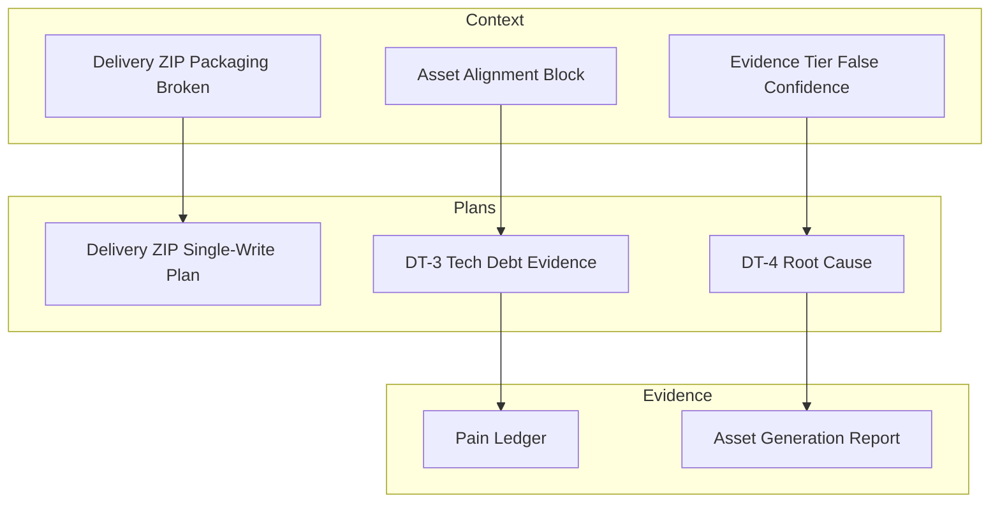
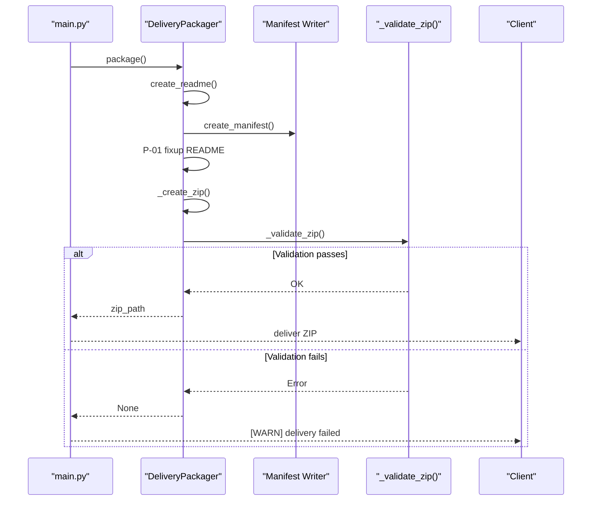
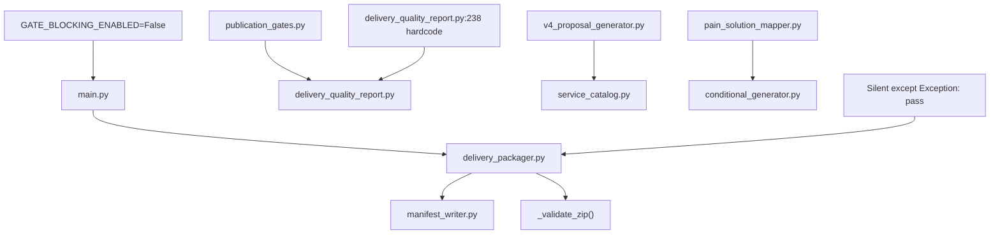

# Troubleshooting and FAQ

<cite>
**Referenced Files in This Document**
- [CONTEXT-DELIVERY-ZIP-PACKAGING-BROKEN-2026-08-01.md](file://context/CONTEXT-DELIVERY-ZIP-PACKAGING-BROKEN-2026-08-01.md)
- [README.md](file://plans/DELIVERY-ZIP-SINGLE-WRITE-2026-08-01/README.md)
- [CONTEXT-EVIDENCE-TIER-FALSE-CONFIDENCE-IAO-2026-07-30.md](file://context/CONTEXT-EVIDENCE-TIER-FALSE-CONFIDENCE-IAO-2026-07-30.md)
- [ZIONE-PROPOSAL-ASSET-ALIGNMENT-BLOCK-2026-07-23.md](file://context/Historico/ZIONE-PROPOSAL-ASSET-ALIGNMENT-BLOCK-2026-07-23.md)
- [DT-4-ROOT-CAUSE-2026-07-25.md](file://context/Historico/CONTEXT-DT-4.md)
- [pain_ledger.json](file://plans/Archives/DT-3-TECH-DEBT-2026-07-25/evidence/pain_ledger.json)
- [asset_generation_report.json](file://plans/Archives/DT4-RESIDUAL-FIXES/evidence/FASE-6/asset_generation_report.json)
- [ROICRIII.md](file://context/Historico/ROICRIII.md)
</cite>

## Table of Contents
1. [Introduction](#introduction)
2. [Project Structure](#project-structure)
3. [Core Components](#core-components)
4. [Architecture Overview](#architecture-overview)
5. [Detailed Component Analysis](#detailed-component-analysis)
6. [Dependency Analysis](#dependency-analysis)
7. [Performance Considerations](#performance-considerations)
8. [Troubleshooting Guide](#troubleshooting-guide)
9. [Conclusion](#conclusion)
10. [Appendices](#appendices)

## Introduction
This document provides comprehensive troubleshooting guidance for the iah-cli system, focusing on frequent issues such as WhatsApp button detection failures, confidence score mismatches, asset alignment problems, and delivery packaging errors. It includes step-by-step diagnostics using evidence collection, log analysis, and validation reports; solutions for configuration and environment setup; error message explanations; performance optimization techniques; migration guides; FAQs; debugging and profiling strategies; and known limitations with workarounds.

## Project Structure
The repository contains extensive context and plan documents that describe recurring issues, root causes, and remediation plans across multiple subsystems:
- Context documents detailing specific bugs and their evidence (e.g., delivery packaging, evidence tier contradictions, asset alignment).
- Plan directories describing phased fixes, dependencies, and post-implementation checks.
- Evidence artifacts (JSON reports) capturing gate results, pain ledgers, and asset generation outcomes.

**Section sources**
- [CONTEXT-DELIVERY-ZIP-PACKAGING-BROKEN-2026-08-01.md](file://context/CONTEXT-DELIVERY-ZIP-PACKAGING-BROKEN-2026-08-01.md)
- [README.md](file://plans/DELIVERY-ZIP-SINGLE-WRITE-2026-08-01/README.md)
- [CONTEXT-EVIDENCE-TIER-FALSE-CONFIDENCE-IAO-2026-07-30.md](file://context/CONTEXT-EVIDENCE-TIER-FALSE-CONFIDENCE-IAO-2026-07-30.md)
- [ZIONE-PROPOSAL-ASSET-ALIGNMENT-BLOCK-2026-07-23.md](file://context/Historico/ZIONE-PROPOSAL-ASSET-ALIGNMENT-BLOCK-2026-07-23.md)
- [DT-4-ROOT-CAUSE-2026-07-25.md](file://context/Historico/CONTEXT-DT-4.md)
- [pain_ledger.json](file://plans/Archives/DT-3-TECH-DEBT-2026-07-25/evidence/pain_ledger.json)
- [asset_generation_report.json](file://plans/Archives/DT4-RESIDUAL-FIXES/evidence/FASE-6/asset_generation_report.json)

## Core Components
Key components involved in common issues include:
- Delivery Packager: responsible for assembling ZIP packages and manifests; prone to size mismatch and self-reference instability.
- Asset Generation Pipeline: maps detected pains to assets; can skip or fail to generate promised assets.
- Publication Gates and Quality Reports: evaluate coherence, coverage, and alignment; may bypass blocking conditions due to miswiring.
- Evidence Tier Calculator: determines financial evidence tiers; can produce contradictory statements if GA4/GSC availability is not considered.

**Section sources**
- [CONTEXT-DELIVERY-ZIP-PACKAGING-BROKEN-2026-08-01.md](file://context/CONTEXT-DELIVERY-ZIP-PACKAGING-BROKEN-2026-08-01.md)
- [CONTEXT-EVIDENCE-TIER-FALSE-CONFIDENCE-IAO-2026-07-30.md](file://context/CONTEXT-EVIDENCE-TIER-FALSE-CONFIDENCE-IAO-2026-07-30.md)
- [ZIONE-PROPOSAL-ASSET-ALIGNMENT-BLOCK-2026-07-23.md](file://context/Historico/ZIONE-PROPOSAL-ASSET-ALIGNMENT-BLOCK-2026-07-23.md)

## Architecture Overview
The iah-cli pipeline generates diagnostic and proposal documents, validates them through publication gates, and delivers packaged assets via ZIP. Common failure points occur when:
- README placeholders are mutated after manifest measurement, causing size mismatches.
- MANIFEST self-reference becomes unstable due to iterative writes.
- Asset alignment promises are not fulfilled because pain-to-asset mappings do not trigger required assets.
- Evidence tier claims contradict configured analytics availability.

**Diagram sources**
- [CONTEXT-DELIVERY-ZIP-PACKAGING-BROKEN-2026-08-01.md](file://context/CONTEXT-DELIVERY-ZIP-PACKAGING-BROKEN-2026-08-01.md)

**Section sources**
- [CONTEXT-DELIVERY-ZIP-PACKAGING-BROKEN-2026-08-01.md](file://context/CONTEXT-DELIVERY-ZIP-PACKAGING-BROKEN-2026-08-01.md)

## Detailed Component Analysis

### Delivery Packaging Failures
Common symptoms:
- ZIP never materializes despite successful asset generation and passing gates.
- MANIFESTs accumulate as orphaned artifacts.
- README references a non-existent ZIP.

Root causes:
- README placeholder replacement changes file size after manifest measurement.
- MANIFEST self-reference correction is inherently unstable due to iterative writes.
- Tests use tolerance while production validation requires exact match.

Diagnostic steps:
- Inspect `output/v4_complete/deliveries/` for MANIFESTs without corresponding ZIPs.
- Compare declared sizes in MANIFEST vs actual disk sizes for README and MANIFEST entries.
- Check `_validate_zip()` error logs for size mismatch messages.

Solutions:
- Implement single-write architecture with fixed-point iteration to eliminate measure-then-mutate ordering issues.
- Update tests to enforce exact size matching without tolerance.
- Ensure cleanup of orphaned artifacts on error paths.

**Section sources**
- [CONTEXT-DELIVERY-ZIP-PACKAGING-BROKEN-2026-08-01.md](file://context/CONTEXT-DELIVERY-ZIP-PACKAGING-BROKEN-2026-08-01.md)
- [README.md](file://plans/DELIVERY-ZIP-SINGLE-WRITE-2026-08-01/README.md)

### WhatsApp Button Detection Failures
Symptoms:
- WhatsApp button skipped as present in production but not included in ZIP.
- Coherence check reports low confidence for WhatsApp verification.
- Pain ledger shows unresolved WhatsApp-related pains.

Root causes:
- Site presence detection occurs after confidence assessment, leading to outdated confidence values.
- Pain-to-asset mapping does not cover all WhatsApp-related scenarios.
- Coverage gates ignore site presence data.

Diagnostic steps:
- Review `asset_generation_report.json` for WhatsApp asset status and coherence scores.
- Examine `pain_ledger.json` for unresolved WhatsApp pains.
- Verify `_check_whatsapp_verified()` logic against site presence report.

Solutions:
- Update `_check_whatsapp_verified()` to consult site presence report and adjust confidence accordingly.
- Extend pain mappings to cover missing WhatsApp scenarios.
- Ensure coverage gates consume site presence data.

**Section sources**
- [azioneproposalassetalignmentblock2026-07-23.md](file://context/Historico/ZIONE-PROPOSAL-ASSET-ALIGNMENT-BLOCK-2026-07-23.md)
- [asset_generation_report.json](file://plans/Archives/DT4-RESIDUAL-FIXES/evidence/FASE-6/asset_generation_report.json)
- [pain_ledger.json](file://plans/Archives/DT-3-TECH-DEBT-2026-07-25/evidence/pain_ledger.json)

### Asset Alignment Issues
Symptoms:
- Proposal promises services that lack corresponding generated assets.
- Gate 9 (proposal_asset_alignment) blocks delivery due to misalignment.
- README references assets not present in ZIP.

Root causes:
- Disconnection between commercial proposal service list and asset generation pipeline.
- Pain-to-asset mappings do not trigger required assets for certain services.
- Delivery quality report ignores real gate results.

Diagnostic steps:
- Compare PROPOSAL_SERVICE_TO_ASSET mapping with actual generated assets.
- Check gate_report.json for proposal_asset_alignment status.
- Verify delivery_quality_report consumes real gate results.

Solutions:
- Add missing pain mappings to trigger asset generation.
- Make proposal conditional based on actual asset generation.
- Fix delivery_quality_report to consume real gate results.

**Section sources**
- [ZIONE-PROPOSAL-ASSET-ALIGNMENT-BLOCK-2026-07-23.md](file://context/Historico/ZIONE-PROPOSAL-ASSET-ALIGNMENT-BLOCK-2026-07-23.md)

### Evidence Tier Mismatches
Symptoms:
- Documents claim Tier A (GA4 + GSC verified) while analytics are not configured.
- Contradictory statements within the same document about evidence quality.
- Precision tier not exposed in visible outputs.

Root causes:
- Evidence tier calculation does not consider GA4/GSC availability.
- Hardcoded relationship text uses stale tier information.
- Template rendering does not expose precision tier.

Diagnostic steps:
- Compare frontmatter evidence tier with analytics configuration status.
- Check financial_scenarios.json for precision tier and relationship text.
- Verify template rendering includes precision tier.

Solutions:
- Modify evidence tier calculation to require GA4/GSC connectivity for Tier A.
- Use dynamic tier information in relationship text.
- Expose precision tier in diagnostic templates.

**Section sources**
- [CONTEXT-EVIDENCE-TIER-FALSE-CONFIDENCE-IAO-2026-07-30.md](file://context/CONTEXT-EVIDENCE-TIER-FALSE-CONFIDENCE-IAO-2026-07-30.md)

## Dependency Analysis
The system exhibits several dependency patterns that contribute to failures:
- Silent fallbacks mask divergent behavior between legacy and FASE-C modes.
- Catch blocks in main pipeline convert critical failures into warnings.
- Multiple sources of truth for service definitions cause inconsistencies.

**Diagram sources**
- [CONTEXT-DELIVERY-ZIP-PACKAGING-BROKEN-2026-08-01.md](file://context/CONTEXT-DELIVERY-ZIP-PACKAGING-BROKEN-2026-08-01.md)
- [CIONE-PROPOSAL-ASSET-ALIGNMENT-BLOCK-2026-07-23.md](file://context/Historico/ZIONE-PROPOSAL-ASSET-ALIGNMENT-BLOCK-2026-07-23.md)

**Section sources**
- [CONTEXT-DELIVERY-ZIP-PACKAGING-BROKEN-2026-08-01.md](file://context/CONTEXT-DELIVERY-ZIP-PACKAGING-BROKEN-2026-08-01.md)
- [CIONE-PROPOSAL-ASSET-ALIGNMENT-BLOCK-2026-07-23.md](file://context/Historico/ZIONE-PROPOSAL-ASSET-ALIGNMENT-BLOCK-2026-07-23.md)

## Performance Considerations
To optimize performance and scalability:
- Profile execution times for asset generation and packaging phases.
- Monitor memory usage during large asset processing operations.
- Implement caching for repeated computations like site presence checks.
- Consider parallel processing for independent asset generation tasks.
- Optimize file I/O operations by batching reads and writes.

[No sources needed since this section provides general guidance]

## Troubleshooting Guide

### WhatsApp Button Detection Failures
Step-by-step diagnosis:
1. Check `asset_generation_report.json` for WhatsApp asset status and coherence scores.
2. Review `pain_ledger.json` for unresolved WhatsApp-related pains.
3. Verify `_check_whatsapp_verified()` logic against site presence report.
4. Examine coverage gates for WhatsApp presence data consumption.

Common fixes:
- Update WhatsApp confidence assessment to use site presence data.
- Extend pain mappings to cover additional WhatsApp scenarios.
- Ensure coverage gates properly handle site presence information.

**Section sources**
- [azioneproposalassetalignmentblock2026-07-23.md](file://context/Historico/ZIONE-PROPOSAL-ASSET-ALIGNMENT-BLOCK-2026-07-23.md)
- [asset_generation_report.json](file://plans/Archives/DT4-RESIDUAL-FIXES/evidence/FASE-6/asset_generation_report.json)
- [pain_ledger.json](file://plans/Archives/DT-3-TECH-DEBT-2026-07-25/evidence/pain_ledger.json)

### Confidence Score Mismatches
Diagnostic procedures:
1. Compare coherence validation scores with asset generation reports.
2. Check if confidence assessments occur before site presence detection.
3. Verify that confidence calculations use current state data.

Resolution steps:
- Reorder operations to ensure confidence assessment happens after site presence detection.
- Update confidence calculation logic to incorporate latest detection results.
- Validate that all confidence sources are synchronized.

**Section sources**
- [azioneproposalassetalignmentblock2026-07-23.md](file://context/Historico/ZIONE-PROPOSAL-ASSET-ALIGNMENT-BLOCK-2026-07-23.md)

### Asset Alignment Issues
Investigation workflow:
1. Compare PROPOSAL_SERVICE_TO_ASSET mapping with generated assets.
2. Check gate_report.json for proposal_asset_alignment status.
3. Verify delivery_quality_report consumes real gate results.
4. Examine pain-to-asset mappings for missing connections.

Fix implementation:
- Add missing pain mappings to trigger required asset generation.
- Make proposal generation conditional on actual asset availability.
- Correct delivery_quality_report to use real gate evaluation results.

**Section sources**
- [CIONE-PROPOSAL-ASSET-ALIGNMENT-BLOCK-2026-07-23.md](file://context/Historico/ZIONE-PROPOSAL-ASSET-ALIGNMENT-BLOCK-2026-07-23.md)

### Delivery Packaging Errors
Troubleshooting approach:
1. Inspect `output/v4_complete/deliveries/` for orphaned MANIFESTs.
2. Compare MANIFEST declared sizes with actual file sizes.
3. Check `_validate_zip()` error logs for specific mismatch details.
4. Verify README placeholder replacement timing relative to manifest measurement.

Corrective actions:
- Implement single-write architecture to prevent measure-then-mutate issues.
- Ensure MANIFEST self-reference convergence through fixed-point iteration.
- Update test suites to enforce exact size matching requirements.

**Section sources**
- [CONTEXT-DELIVERY-ZIP-PACKAGING-BROKEN-2026-08-01.md](file://context/CONTEXT-DELIVERY-ZIP-PACKAGING-BROKEN-2026-08-01.md)

### Configuration and Environment Setup Problems
Common issues:
- Missing GA4/GSC credentials preventing evidence tier validation.
- Incorrect environment variables affecting analytics client availability.
- Service account configuration problems for Google APIs.

Resolution steps:
- Verify GA4_PROPERTY_ID and GA4_CREDENTIALS_PATH configuration.
- Ensure GSC_SITE_URL is properly set for Search Console access.
- Confirm service account has appropriate permissions for both GA4 and GSC.

**Section sources**
- [CONTEXT-EVIDENCE-TIER-FALSE-CONFIDENCE-IAO-2026-07-30.md](file://context/CONTEXT-EVIDENCE-TIER-FALSE-CONFIDENCE-IAO-2026-07-30.md)

### Migration and Upgrade Guides
When upgrading between versions:
1. Review CHANGELOG.md for breaking changes.
2. Update configuration files to match new schema requirements.
3. Test with sample data before production deployment.
4. Validate that existing integrations remain compatible.

Backward compatibility considerations:
- Maintain support for legacy modes during transition periods.
- Provide migration scripts for automated updates where possible.
- Document deprecated features and their replacements.

**Section sources**
- [ROICRIII.md](file://context/Historico/ROICRIII.md)

### Debugging Techniques and Profiling Tools
Recommended approaches:
- Enable detailed logging for critical pipeline stages.
- Use Python profilers (cProfile, memory_profiler) for performance analysis.
- Implement structured logging with correlation IDs for request tracing.
- Create diagnostic endpoints for runtime inspection.

Monitoring strategies:
- Set up alerts for critical failures in delivery packaging.
- Monitor memory usage patterns during asset generation.
- Track execution times for each pipeline phase.
- Implement health check endpoints for system status monitoring.

[No sources needed since this section provides general guidance]

### Known Limitations and Workarounds
Current limitations:
- WhatsApp detection relies on external site scanning which may be unreliable.
- Evidence tier determination requires manual configuration of analytics credentials.
- Asset generation depends on accurate pain detection which may miss edge cases.

Workaround strategies:
- Implement fallback mechanisms for unreliable external dependencies.
- Provide manual override options for automated decisions.
- Create comprehensive test suites covering edge cases.

[No sources needed since this section provides general guidance]

## Conclusion
The iah-cli system faces several interconnected challenges related to asset generation, delivery packaging, and evidence validation. Successful resolution requires addressing architectural issues around timing and consistency, improving detection accuracy for external dependencies, and ensuring robust error handling throughout the pipeline. The provided troubleshooting guide offers systematic approaches to diagnosing and resolving these issues while maintaining system reliability and performance.

[No sources needed since this section summarizes without analyzing specific files]

## Appendices

### FAQ Section

**Q: Why does my WhatsApp button detection show low confidence?**
A: The confidence assessment occurs before site presence detection. Update the `_check_whatsapp_verified()` function to consult the site presence report and adjust confidence accordingly.

**Q: How do I fix evidence tier contradictions in my reports?**
A: Ensure the evidence tier calculation considers GA4/GSC availability. Modify the tier determination logic to require analytics connectivity for Tier A classification.

**Q: What should I do when delivery packaging fails silently?**
A: Check for silent exception handling in the delivery packager. Replace `except Exception: pass` with proper logging and error propagation to surface failures.

**Q: How can I improve asset alignment between proposals and generated assets?**
A: Extend pain-to-asset mappings to cover all promised services and make proposal generation conditional on actual asset availability.

**Q: What performance optimizations should I implement?**
A: Profile execution times, monitor memory usage, implement caching for repeated computations, and consider parallel processing for independent tasks.

[No sources needed since this section provides general guidance]